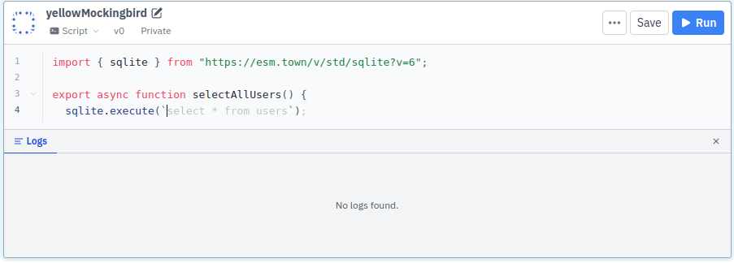

import Townie from "./val-town-newsletter-18/townie.png";
import Codeium from "./val-town-newsletter-16/codeium.png";

Since the beginning of Val Town, our users have been clamouring for the state-of-the-art <abbr title="Large Language Model">LLM</abbr> code generation experience. When we launched in 2022, it was GitHub Copilot. But soon it was ChatGPT, then Claude Artifacts, and now [Bolt](https://bolt.new/), [Cursor](https://www.cursor.com/), and [Windsurf](https://codeium.com/windsurf). We've been trying our best to keep up. Looking back over 2024, our efforts have really been a series of _fast-follows_, copying the innovation of others. Some have been successful, and others false-starts. This article is a historical account of our efforts, giving credit where it is due.

### GitHub Copilot Completions

The story starts, of course, with GitHub Copilot. From day 1, Val Town users begged for a GitHub-Copilot-like completions experience.

We were wary of building this ourselves, but one day we stumbled upon Asad Memon’s [codemirror-copilot](https://github.com/asadm/codemirror-copilot), and hooked it up. That gave us our first taste of LLM-driven autocomplete, but behind the scenes, it was using ChatGPT. The prompt essentially asked ChatGPT to cosplay as an autocomplete service and fill in the text at the user’s cursor. So it was fairly slow, occasionally the model would forget its role and do something unexpected, and it didn't have the accuracy of a purpose-built autocomplete model.

We wanted a faster, more accurate autocomplete sytem, one that used a model trained for the task - which is technically called ['Fill in the Middle'](https://arxiv.org/abs/2207.14255). Finding an option that we could use within a product like Val Town was tricky – Copilot and most of its competitors lack documented or open APIs. But [Codeium](https://codeium.com/) did, and they also had very good accuracy and performance. We [launched Codeium completions](https://blog.val.town/blog/val-town-newsletter-16/#-codeium-completions) in April 2024 and open-sourced our [codemirror-codeium](https://github.com/val-town/codemirror-codeium) component. It's been pretty great. It's enabled by default for new users.



### ChatGPT

Then came ChatGPT. We found our users asking it to write Val Town code, and copying and pasting it back into Val Town. We figured we could automate that process for our users: provide an interface with a pre-filled system prompt and a one-click way to save the generated code as a val.


The [first version of Townie](https://blog.val.town/blog/val-town-newsletter-18/#-townie) was born: a simple chat interface, very much inspired by ChatGPT, powered by GPT-3.5. It was just ok. It didn't get much use, mostly because it was hard to iterate on its results. Getting good results from an LLM usually requires a conversation because programming-via-English is pretty imprecise, and you need follow-up requests to clarify your needs.

### ChatGPT Tool Use

Earlier this year, ChatGPT Function Calling, now called 'tool-use', was seen as the next big thing. The promise was that with a good OpenAPI spec, AI would be able to help our users do just about anything on Val Town. So we dutifully cleaned up our OpenAPI spec, and [rebuilt Townie around it](https://blog.val.town/blog/openapi/#our-ai-townie-can-now-call-our-rest-api).

<iframe
  width="100%"
  height="420"
  src="https://www.youtube-nocookie.com/embed/clj1prZunW0?si=O7l6qvW8B2OB79NT"
  title="YouTube video player"
  frameborder="0"
  allow="accelerometer; autoplay; clipboard-write; encrypted-media; gyroscope; picture-in-picture; web-share"
  referrerpolicy="strict-origin-when-cross-origin"
  allowfullscreen
></iframe>

It was, ahem, fine. Function calling was a disappointment. You do all the work to provide the LLM with a strict definition of what functions it can call and with which arguments. But even all of that, the LLM would hallucinate things that didn't exist. Function calling has improved since, with the introduction of [Structured Outputs](https://platform.openai.com/docs/guides/function-calling#structured-outputs).

But for us, the issue was that the interface was too generic. In theory, it was capable of doing anything (editing your blobs or sqlite data), but it wasn't very useful at any specific thing. Most notably, it wasn't a good interface for writing code. It could write the code, but it wasn't optimized to let you run that code, see the output, debug it, ask the AI for more help, etc. In other words, the feedback loop was bad.

### Claude Artifacts

We had begun to see the potential of Claude for code generation with the amazing results produced by [Websim](https://websim.ai/). But it was the [launch of Claude 3.5 Sonnet and Claude Artifacts](https://www.anthropic.com/news/claude-3-5-sonnet) that really got our attention. Claude 3.5
Sonnet was step-function in LLM code generation. It blew all of our minds. And Claude Artifacts solved the tight feedback loop problem that we saw with our ChatGPT tool use version. And thus after about a month of prototyping and building, the [current version of Townie](https://blog.val.town/blog/codegen/) was born in August 2024.

For a couple weeks there, it felt like we had one of the best tools in the space. We were the only tool that could generate a fullstack app, with a frontend, backend, and database, in minutes, and fully deployed. Now it feels like there are dozens. Live by the fast follow; die by the fast follow.

### Our Contributions

While we were out in front, we invested a lot of resources in trying to stay there, and we made some contributions of our own that have since found there way into other tools in the space.

#### Speed

The biggest problem with all current codegen systems is the speed of generation. It takes minutes to generate just a couple hundred lines of code. If you regenerate the whole file every time – which is how most systems work – that means minutes between every feedback loop. (Not to mention the cost of regenerating the whole file every time, even when you are making a small change.)

We worked hard to get the LLM producing diffs, based on [work we saw in Aider](https://aider.chat/docs/unified-diffs.html). We were able to get it to work most of the time, but not reliably enough to be on by default. It's now off by default, but you can ask Townie to "reply in diff" if you'd like to try your luck with it.

Our system prompt has always been open (you can view it in your Townie settings), so you can see how we're doing that. Here's the relevant section:

````md
Follow the requirements above and respond by generating code in a format based on whether or not the user explicitly requests diff format in their most recent prompt:

- If the user does not explicitly request diff format in their prompt, generate the entire val:
  Use <existing_code> as the basis for generating code if it is provided.
  Write code that is complete and directly runnable.
  DO NOT omit code or use comments such as "more content here" or "code remains unchanged."
  Write the code in `val code fences.
Include the val type as metadata on the code fence, e.g.: `val type=script
  If this is a new val, decide what val type is appropriate based on the user's prompt. Default to choosing http type vals unless the user has requested specific functionality that requires a different type.

- If the user requests diff format in their prompt, follow these steps:
  Write a valid unified diff with change hunk headers. The file headers can be omitted.
  Base the diff off of the <existing_code> tags below.
  Use the ```diff language code fence.
````

We've gotten scared off of investing more time in diffs right now, but I expect it may have been solved by others in the space already, or will be shortly. Anthropic's long-rumored "fast-edit mode" could do it. OpenAI launched their own [Predicted Outputs](https://platform.openai.com/docs/guides/predicted-outputs), which is also compelling. Or maybe the solution is simply faster models, smaller, mini-models, or faster chips, like Groq or Cerebras. A couple weeks ago I built [Cerebras Coder](https://cerebrascoder.com) to demonstrate how powerful an instant feedback loop is for code generation. [Try it out yourself](https://cerebrascoder.com) or [fork it here](https://www.val.town/v/stevekrouse/cerebras_coder).

<video controls>
  <source src="/video/cerebras-coder.mp4" />
</video>

DeepSeek [recently open-sourced an almost-Sonnet-3.5-level model that's twice as fast and trained for merely $6m](https://x.com/deepseek_ai/status/1872242657348710721). Just today, [a company announced a that they fine-tuned Llama 3.3 70b to get more accurate results than Claude 3.5 Sonnet](https://finecodex.com/). A boy can dream of a world where Sonnet-3.5-level codegen (or even smarter!) is available on a chip like Cerebras at a fraction of Anthropic's cost. I think that would unleash a whole new class of innovation here.

#### Autodetecting errors

We did contribute one possibly-novel UI interaction, where the LLM automatically detect errors and ask you if you'd like it to try to solve them. We detect server-side errors by polling our backend for 500 errors in your logs. We detect client-side errors in the iframe by prompting Townie to import [this client-side library](https://www.val.town/v/std/catch), which in turns pushing errors up to the parent window.

<video controls>
  <source src="/video/TownieErrorDetection.mp4" />
</video>

It's not particularly novel in that others would have thought of this if we didn't, but maybe the folks at [Anthropic](https://support.anthropic.com/en/articles/9949260-try-fixing-with-claude-for-artifact-errors) or Bolt saw our implementation and it inspired their own. I'd like to think we're not _only_ free-riding in this space.

### Hosted runtime and included APIs

Maybe some of our UI ideas made it into GitHub Spark too, including deployment-free hosting, and persistent data storage, and the ability to use LLMs in your apps without a your own API key – their versions of [@std/sqlite](https://docs.val.town/std/sqlite/) and [@std/openai](https://docs.val.town/std/openai/), respectively. In other words, you can say, "make me a ChatGPT clone with persistent thread history", and in about 30 seconds, you'll have a deployed app that does exactly that.

<video controls>
  <source src="/video/TownieChatGPTClone.mp4" />
</video>

But we're not the first hosting company to provide an LLM tool; that
honor likely goes to Vercel's [v0](https://v0.dev/).

### Cursor

The next big thing was [Cursor](https://www.cursor.com/). I must admit that I never personally fell in love with it, but given how many people I respect love it, I think that's a me-problem. I think Cursor best for development in larger codebases, but recently my work recently has been on making vals in Val Town, which up until now have been smaller, single-file projects, of 1000 lines or less. (Our upcoming launch of multi-file Projects, now in private beta, will change this.) However Cursor is a real pioneer in the space, and has some UI interactions there that we have an eye to copy.

### Windsurf

Over the holiday, I fell in love with [Windsurf](https://codeium.com/windsurf) by the folks at Codeium. Its Cascade feature is a chat interface, which has tool use and multi-turn agentic capabilities, to search through your codebase and edit multiple files. It feels a bit like we're coming full-circle back to when we did our tool-use version of Townie. However, I think we now all understand that you can't simply give your whole OpenAPI spec to an LLM and expect good results. The magic of Windsurf is that they carefully crafted what actions their agent can take.

I am salivating at the idea of giving Townie some of these capabilities. Imagine if Townie could search through all public vals, and maybe even npm, to find code to help you.

### Devin

Watching Windsurf take multiple actions on my behalf without my input is very inspirational. I'm dreaming of a world where Townie not only detects errors, but also automatically tries to fix them, possibly multiple times, possibly in parallel in multiple branches, without any human interaction. Here, of course, we'd be getting into territory mostly explored by the folks at [Devin](https://devin.ai/).

For starters, we could feed back screenshots of the outputted website back to the LLM, but eventually you could imagine giving it a full web browser so it can itself poke around the app, like a human would, to see what features work and which ones don't. And then write itself some tests, also like a human would, to make sure things don't break as it continues to iterate.

I have a vague sense by the end of this year that you'll be able to tell Townie to "make a fully realistic Hacker News Clone, with user accounts, nested comments, upvotes, downvotes" and it could iterate for hours on your behalf. You could even go to bed and wake up with it done.

### Collaboration and competition

Is this fast-following competitive or is it collaborative? So far it's been feeling mostly collaborative. The pie is so freaking large -- there are millions and maybe billions who are jumping at the chance to code -- that we're all happy to help each other scramble to keep up with the demand. I love that, and hope it remains this way. We at Val Town certainly don't keep (m)any secrets. Our system prompt is open, and we blog openly about all our interesting technical choices. This very post is a case in point.

### Should we bow out?

All this copying and how fast everything is moving begs teh question: Should we get out of this race entirely and just do a better job integrating with the editors like VSCode, Cursor, Windsurf, and even Bolt? Maybe! We're planning to dip our toes into integrating: we're planing more local development support, and possibly even a FUSE virtual filesystem that could make it easy to use any editors with Val Town.

However, it still feels like there's a lot to be gained with a fully integrated web AI code editor experience in Val Town – even if we can only get 80% of the features that the big dogs have, and a couple months later. We have had a lot of success fast-following so far, and think it's worth continuing to do so.

### Townie

If you've made it this far in the article, you should really [try out Townie](https://www.val.town/townie). It's still is one of the best tools to create fullstack web apps. Make yourself a ['what did I work on today' app that pulls from Linear and GitHub](https://www.val.town/v/danphilibin/what_did_i_work_on_today), [a tool to extract dominant colors from an image](https://x.com/destroytoday/status/1856709997737984089), or [an AI clone for your personality](https://deeperfates.com/). And if you do, please let me know (steve@val.town) what features from other tools you'd like to see in Townie. We're eager to learn from you.
