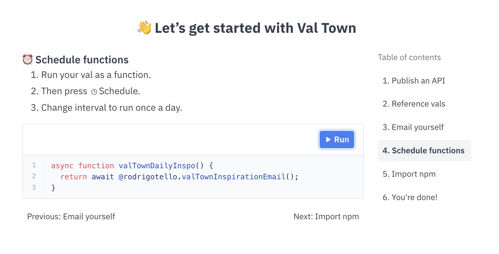
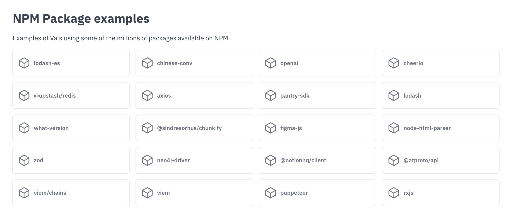
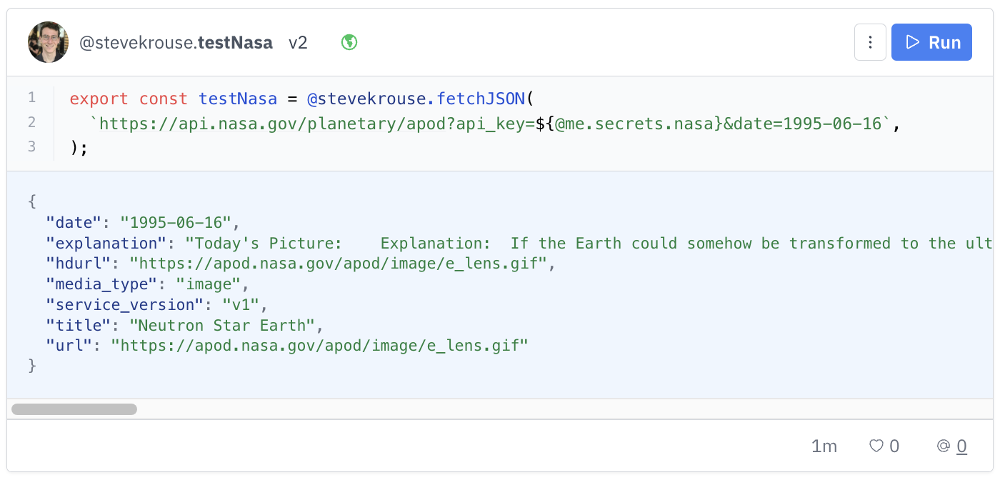

Val Town turns one today! In the last two weeks we shipped Val READMEs, the new val.run Express API, a redesigned Val action menu, a dozen new guides, a RFC for an expanded Vals API, a blog post about Public Key Auth, example pages around NPM packages and APIs, more `fetch` proxies, and more. I also recorded a new video. A lot has changed since the [last one in February](https://www.loom.com/share/c075dc075909400a85591ac3f83d1ca5?sid=397333f9-c87d-4647-92ae-6e8903547da8)!

  <lite-youtube videoid="ypHbuRjUChc">
    &#x20;
  </lite-youtube>

### A year of Val Town

Val Town turns one year old today 🥳

It’s been a fun year! I’m very grateful to all of you for investing your time and creativity in our nascent platform, and our team and advisors for believing in us and working hard this year.

I am happy with our progress and how we iterate quickly. We have built a elegant product that hundreds of people get value from. We have a small group of passionate users. We have revenue.

We are still in search of explosive product-market-fit growth. We want individual vals to go viral, which would bring new users to Val Town, making their own viral vals, which would get more users… and we’re off to the races! I have faith that if we keep listening to users, grinding on the product, and are thoughtful about facilitating creativity and virality, sparks will fly, magic will happen, and things will go up and to the right.

Our ambition is to be the default place code runs, from hobby projects to production code. We have a long way to go, but a good start, a great team, and a plucky can-do attitude.

Here’s to the next year of Val Town!

### Changelog

### Val READMEs

Add markdown READMEs to your vals.

### val.run

In response to a security vulnerability, we moved up the launch of our the new val.run Express API. It is entirely subdomain-based to provide an isolated security model and allow for fully-customizable API paths, as required by some webhook specs, such as ChatGPT plugins. Read more in [the announcement post](https://blog.val.town/blog/introducing-valrun).

### Val action menu

Val’s new action menu combines four buttons (Share, Logs, Move, Schedule) into one.

### Guides

The guides section on [docs.val.town](https://docs.val.town/) has been expanded to include more examples of things you do can with vals like [creating web hooks](https://docs.val.town/creating-a-webhook), [web scraping](https://docs.val.town/web-scraping), [saving form data](https://docs.val.town/save-html-form-data), [generating PDFs](https://docs.val.town/generate-pdfs), and more including more service-specific guides like setting up chat bots, and fetching and storing data.

### _Expanding the Vals API - RFC_

We have [a RFC](https://blog.val.town/blog/expanding-the-vals-api-rfc) open to enable more programmatic use of Val Town, and to support the pioneers who are building tools that currently use our undocumented, unstable, internal API. It’s only open until Sunday, July 9th, so please get your comments in asap!

### Truncated output

We recently instituted hard 100kb limits on val outputs. Now instead of throwing an error and returning nothing, we truncate the outputs at 100kb and try to “[repair](https://www.npmjs.com/package/jsonrepair)” the remaining output to be valid JSON. This is meant to be a strict improvement over showing you nothing, but it’s still not an ideal user experience. We have plans to increase these limits in a more scalable way in the medium-term.

### Public Key Auth

I prototyped [a authentication protocol for Val Town users](https://blog.val.town/public-key-auth-val-town-users-can-be-your-users) so Val Town users can authenticate themselves when calling each others’ vals. This work paves the way for per-user rate limiting and billing within Val Town.

### Inspiration emails

One of the biggest requests when folks sign up to Val Town is for us to “inspire” them with potential uses of the product. We are experimenting with having you setup your own inspiration emails about what you can use Val Town for — during the onboarding tutorial! We have you schedule a val that will send you an email of an inspiring val or usecase every day. [You can set yours up here](https://www.val.town/docs/tutorial/4). Because it’s just a normal val, you can modify it, improve it, whatever you want.

### API & NPM Examples

We want Val Town to be _*the*_ place you go for examples of how to use an NPM package or use an API. Now you (and Google searchers) can explore Val Town from the perspective of APIs and NPM packages.

[https://twitter.com/Zephraph/status/1672411315292323840?s=20](https://twitter.com/Zephraph/status/1672411315292323840?s=20)

You can browse by API:

  <iframe src="https://www.val.town/examples/apis" width="100%" frameborder="no" style="height: 400px;">
    &#x20;
  </iframe>

Or by NPM package:

  <iframe src="https://www.val.town/examples/packages" width="100%" frameborder="no" style="height: 400px;">
    &#x20;
  </iframe>

### More `fetch` proxies

We proxy all `fetch` requests so you aren’t affected by the fetching of other Val Town users. Every request comes from a different IP address. However we used to only have one proxy which didn’t allow .gov URLs and many other limitations. Now we have multiple proxies so we can support many more (hopefully all) URLs now.

Now

Before

### Secrets upgrades

Some quality of life upgrades to the [Secrets page](https://www.val.town/settings/secrets) to let you update existing secrets in-place and check when a secret was last updated.

### Link to val version

You can link to a specific val version now, via `?v=version`, ie [val.town/v/pdebie.publishYoutubeToLemmy?v=25](https://www.val.town/v/pdebie.publishYoutubeToLemmy?v=25).

Tip: If you share a val URL in a social network, you get a pretty share URL image of the version of your code at that moment in time, but this is a heavily cached image. You can always get the appropriate version of that image by passing a version number.

  <iframe src="https://www.val.town/embed/pdebie.publishYoutubeToLemmy.png?v=25" width="100%" frameborder="no" style="height: 400px;">
    &#x20;
  </iframe>

### Trending algorithm updated

Now it’s likes / age^1.5, where having a README counts as 5 likes, and you need at least one like to show up at all (but you can like your own val).

### Discord welcome bot

Get welcomed to Val Town, by Val Town, and [learn how to build this bot yourself](https://docs.val.town/create-a-discord-welcome-bot).

### Cuter val names

What looked like `untitled_E8W8FGY` now is now the friendlier `untitled_magentaMarmoset`.

Now

Before

### Footer

Mostly for Google to see all our pages, but you may find it useful too.

### Misc

- `setTimeout` is back, but [not persistent/durable](https://docs.val.town/gotchas#e89ca9ef411f4cfaa3265f216449b79e)
- Val names are now represented as case insensitive (citext)
- You now can reuse val names after a deletion
- User profiles are now nested under /u/handle
- Cmd-enter to submit the feedback form
- val.town/docs redirects to docs.val.town
- Unreachable code warning

### Roadmap

As always we’re quite responsive to feedback and suggestions, so let us know what you want. We’re planning:

- `console.sms`
- Vals API (to power a VS Code extension & more!)
- Fork Vals (in a first-class, semantic way where we track this in the database)
- Autosave unsaved changes
- Swag
- Notifications (errors, likes, references, forks, etc)
- Improvements to embedded vals
- OAuth Helpers - get auth tokens to your favorite apps
- Public folders
- Val version pinning
- Comments on vals
- Integrated LLMs (have AI write your vals for you)
- More web-standard and JS compatibility

### Cool tweets

[https://twitter.com/stungeye/status/1671241335100297216?s=20](https://twitter.com/stungeye/status/1671241335100297216?s=20)

[https://twitter.com/stevekrouse/status/1674107868658692098?s=20](https://twitter.com/stevekrouse/status/1674107868658692098?s=20)

[https://twitter.com/stevekrouse/status/1674486635860246528?s=20](https://twitter.com/stevekrouse/status/1674486635860246528?s=20)

[https://twitter.com/stevekrouse/status/1674100338683412507?s=20](https://twitter.com/stevekrouse/status/1674100338683412507?s=20)

[https://twitter.com/stevekrouse/status/1671213704526823428?s=20](https://twitter.com/stevekrouse/status/1671213704526823428?s=20)

[https://twitter.com/stevekrouse/status/1671621646673739779?s=20](https://twitter.com/stevekrouse/status/1671621646673739779?s=20)

[https://twitter.com/n_moore/status/1673439853294374915?s=20](https://twitter.com/n_moore/status/1673439853294374915?s=20)

[https://twitter.com/stevekrouse/status/1674109636683653120?s=20](https://twitter.com/stevekrouse/status/1674109636683653120?s=20)

[https://twitter.com/wesbos/status/1674428534734069765?s=20](https://twitter.com/wesbos/status/1674428534734069765?s=20)

[https://twitter.com/stevekrouse/status/1674457831074930688?s=20](https://twitter.com/stevekrouse/status/1674457831074930688?s=20)

[https://twitter.com/stevekrouse/status/1672271402672553984?s=20](https://twitter.com/stevekrouse/status/1672271402672553984?s=20)

[https://twitter.com/stevekrouse/status/1672000502446292993?s=20](https://twitter.com/stevekrouse/status/1672000502446292993?s=20)

### Cool Vals

  <iframe src="https://www.val.town/embed/easrng.rssViewer" width="100%" frameborder="no" style="height: 400px;">
    &#x20;
  </iframe>

  <iframe src="https://www.val.town/embed/pomdtr.svgEmoji" width="100%" frameborder="no" style="height: 400px;">
    &#x20;
  </iframe>

  <iframe src="https://www.val.town/embed/pomdtr.badge" width="100%" frameborder="no" style="height: 400px;">
    &#x20;
  </iframe>

  <iframe src="https://www.val.town/embed/vtdocs.resyBot" width="100%" frameborder="no" style="height: 400px;">
    &#x20;
  </iframe>

  <iframe src="https://www.val.town/embed/vtdocs.examplePDF" width="100%" frameborder="no" style="height: 400px;">
    &#x20;
  </iframe>

  <iframe src="https://www.val.town/embed/easrng.examplePreactWebApp" width="100%" frameborder="no" style="height: 400px;">
    &#x20;
  </iframe>

  <iframe src="https://www.val.town/embed/pdebie.publishYoutubeToLemmy" width="100%" frameborder="no" style="height: 400px;">
    &#x20;
  </iframe>

  <iframe src="https://www.val.town/embed/gregsadetsky.stripeWebhookToEmail" width="100%" frameborder="no" style="height: 400px;">
    &#x20;
  </iframe>

  <iframe src="https://www.val.town/embed/vtdocs.uploadTextToS3" width="100%" frameborder="no" style="height: 400px;">
    &#x20;
  </iframe>

  <iframe src="https://www.val.town/embed/vtdocs.browserlessPuppeteerExample" width="100%" frameborder="no" style="height: 400px;">
    &#x20;
  </iframe>

  <iframe src="https://www.val.town/embed/simply_say_m.getActivityAndGiphy" width="100%" frameborder="no" style="height: 400px;">
    &#x20;
  </iframe>

  <iframe src="https://www.val.town/embed/ericlee4.eclipseStreamData" width="100%" frameborder="no" style="height: 400px;">
    &#x20;
  </iframe>

  <iframe src="https://www.val.town/embed/webup.moderateSampleHate" width="100%" frameborder="no" style="height: 400px;">
    &#x20;
  </iframe>

  <iframe src="https://www.val.town/embed/thedavis.whoNext" width="100%" frameborder="no" style="height: 400px;">
    &#x20;
  </iframe>

