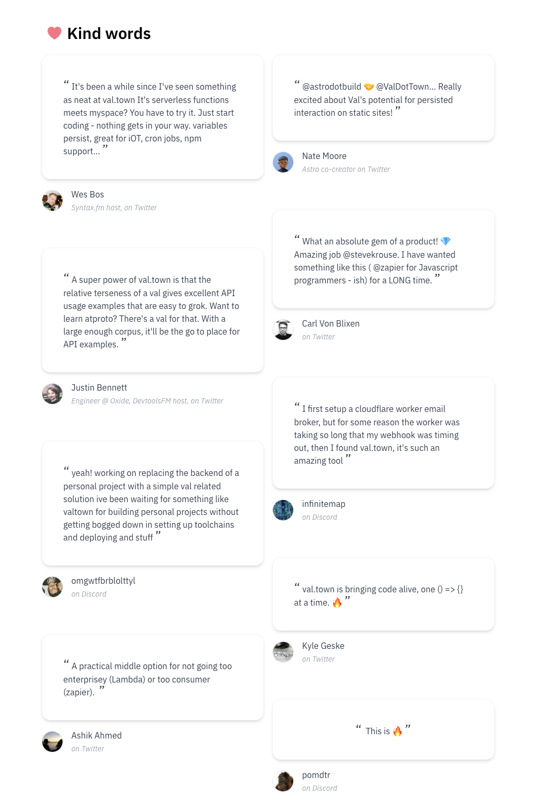

This month we shipped autosave, comments, email a val, an expanded API, and dozens more features, big and small. We’re hiring a full time engineer in NYC and a part-time docs writer. We were featured on a couple of podcasts and newsletters, and y’all tweeted some really cool vals.

### We’re hiring!

We’re looking for [a founding engineer to join us in New York](https://about.val.town/founding-engineer-at-val-town).

We’re also hiring someone to help with docs and community part-time and remote.

Come work with us! Email me at steve@val.town if you’re interested.

### Podcasts

I did a bit of a podcast tour over the last month, and it was a lot of fun!

- [Supper Club × val.town with Steve Krouse](https://syntax.fm/show/640/supper-club-val-town-with-steve-krouse)
- [JavaScript Jam with Steve Krouse](https://www.javascriptjam.com/july-25-2023/)
- [What makes programming fun?](https://www.youtube.com/watch?v=ZmRJ6PgVOdM&feature=youtu.be)

### Changelog

#### Autosave vals

Vals now autosave in localstorage, so you can fearlessly leave the tab without losing your work.

[https://youtu.be/y5WlxuZJwtk](https://youtu.be/y5WlxuZJwtk)

#### Comments on vals

You can now write helpful and constructive comments on vals!

#### Last runs preview

#### Trigger vals via email

Now you can send an email to a val to trigger it to run. Each val gets its own email address: `username.valname@valtown.email`. The val gets passed the email data as the first argument. Try it out by sending an email to [stevekrouse.testEmail2@valtown.email](mailto:stevekrouse.testEmail2@valtown.email) to trigger this val:

  <iframe src="https://www.val.town/embed/stevekrouse.testEmail2" width="100%" frameborder="no" style="height: 400px;">
    &#x20;
  </iframe>

#### Expanded API

We quietly released the first expansion of our API to let you list & search vals and users. Nico and Achille from our community were quick to release a [zod client](https://www.npmjs.com/package/valtown-zod-client), which works on Val Town.

  <iframe src="https://www.val.town/embed/pomdtr.testVtClient" width="100%" frameborder="no" style="height: 400px;">
    &#x20;
  </iframe>

#### What can I do with Val Town?

  <iframe src="https://www.val.town/examples/use-cases" width="100%" frameborder="no" style="height: 400px;">
    &#x20;
  </iframe>

### Testimonials

  <iframe src="https://www.val.town/#testimonials" width="100%" frameborder="no" style="height: 400px;">
    &#x20;
  </iframe>

### Tailored Guides

We customize your initial home screen with content related to the answers you gave during your onboarding.

### Redesigned tips & feedback

### Misc

- View [all the vals you liked](https://www.val.town/settings/likes)
- Disable-able code transformations (in [preferences](https://www.val.town/settings/preferences))
- Types
- Social links (in [preferences](https://www.val.town/settings/preferences))
- More `fetch` proxies (now you can fetch from .gov!)
- Welcome email (that you send yourself in the onboarding tutorial via console.email!)
- Link to a prefilled new val editor ([example](https://val.new/?code=%22hello+there%21%22))
- The limit on val sizes is 250kb for pro users
- Upgraded to Deno 1.35.0
- Better error messages on the Run API
- Improved output types of `api`
- Placeholder text in new val editor
- Type acquisition from esm.sh
- Polishes to our quick-search component
- Full text searches README content
- Polishes to the new val editor
- View [trending scheduled vals](https://www.val.town/trending?scheduled=true)

### Roadmap

- Notifications (errors, likes, references, forks, etc)
- Fork Vals (in a first-class, semantic way where we track this in the database)
- Expanded API (to power a VS Code extension & more!)
- Discord bot tutorials and guides
- Improvements to embedded vals
- Public folders
- Val version pinning
- Integrated LLMs (have AI write your vals for you)
- More web-standard and JS compatibility

### Cool ~~tweets~~ X’s

[https://twitter.com/wesbos/status/1681341649786486785?s=20](https://twitter.com/wesbos/status/1681341649786486785?s=20)

[https://twitter.com/stevekrouse/status/1684942769381359616?s=20](https://twitter.com/stevekrouse/status/1684942769381359616?s=20)

[https://twitter.com/JavascriptJam/status/1684274929104199682?s=20](https://twitter.com/JavascriptJam/status/1684274929104199682?s=20)

[https://twitter.com/n_moore/status/1682112004461404160?s=20](https://twitter.com/n_moore/status/1682112004461404160?s=20)

[https://twitter.com/MerlinMason/status/1681604496395235328?s=20](https://twitter.com/MerlinMason/status/1681604496395235328?s=20)

[https://twitter.com/brianbriscoe\_/status/1679816000475103234?s=20](https://twitter.com/brianbriscoe_/status/1679816000475103234?s=20)

[https://twitter.com/stevekrouse/status/1679571913465577473?s=20](https://twitter.com/stevekrouse/status/1679571913465577473?s=20)

[https://twitter.com/tmcw/status/1679534366647541766?s=20](https://twitter.com/tmcw/status/1679534366647541766?s=20)

[https://twitter.com/stevekrouse/status/1678879302895501312?s=20](https://twitter.com/stevekrouse/status/1678879302895501312?s=20)

[https://twitter.com/stevekrouse/status/1678501946406182913](https://twitter.com/stevekrouse/status/1678501946406182913)

[https://twitter.com/tmcw/status/1677345559479308292?s=20](https://twitter.com/tmcw/status/1677345559479308292?s=20)

[https://twitter.com/stevekrouse/status/1684942769381359616?s=20](https://twitter.com/stevekrouse/status/1684942769381359616?s=20)

[https://twitter.com/VladyslavSitalo/status/1682534233070510080?s=20](https://twitter.com/VladyslavSitalo/status/1682534233070510080?s=20)

[https://twitter.com/carlvonblixen/status/1680104094927671296?s=20](https://twitter.com/carlvonblixen/status/1680104094927671296?s=20)

[https://twitter.com/ValDotTown/status/1682383005204066310?s=20](https://twitter.com/ValDotTown/status/1682383005204066310?s=20)

[https://twitter.com/\_jessicasachs/status/1681748098236776450?s=20](https://twitter.com/_jessicasachs/status/1681748098236776450?s=20)

[https://twitter.com/TeviePy/status/1681045530472861698?s=20](https://twitter.com/TeviePy/status/1681045530472861698?s=20)

[https://twitter.com/Julien_Delort/status/1680208141995130881?s=20](https://twitter.com/Julien_Delort/status/1680208141995130881?s=20)

[https://twitter.com/tmcw/status/1679579980840173568?s=20](https://twitter.com/tmcw/status/1679579980840173568?s=20)

[https://twitter.com/Andre_Terron/status/1679565630989582338?s=20](https://twitter.com/Andre_Terron/status/1679565630989582338?s=20)

[https://twitter.com/stevekrouse/status/1679519695680991233?s=20](https://twitter.com/stevekrouse/status/1679519695680991233?s=20)

[https://twitter.com/stevekrouse/status/1678855311833153536?s=20](https://twitter.com/stevekrouse/status/1678855311833153536?s=20)

[https://twitter.com/stevekrouse/status/1678425626712190977?s=20](https://twitter.com/stevekrouse/status/1678425626712190977?s=20)

[https://twitter.com/tmcw/status/1676993679855058953?s=20](https://twitter.com/tmcw/status/1676993679855058953?s=20)

[https://twitter.com/stevekrouse/status/1676976026214072323?s=20](https://twitter.com/stevekrouse/status/1676976026214072323?s=20)
