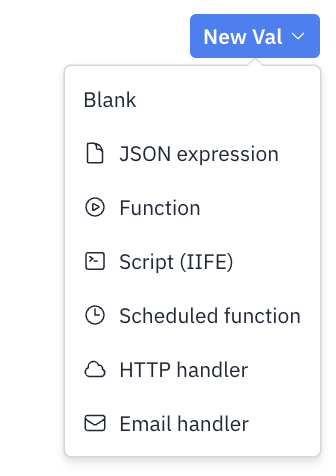
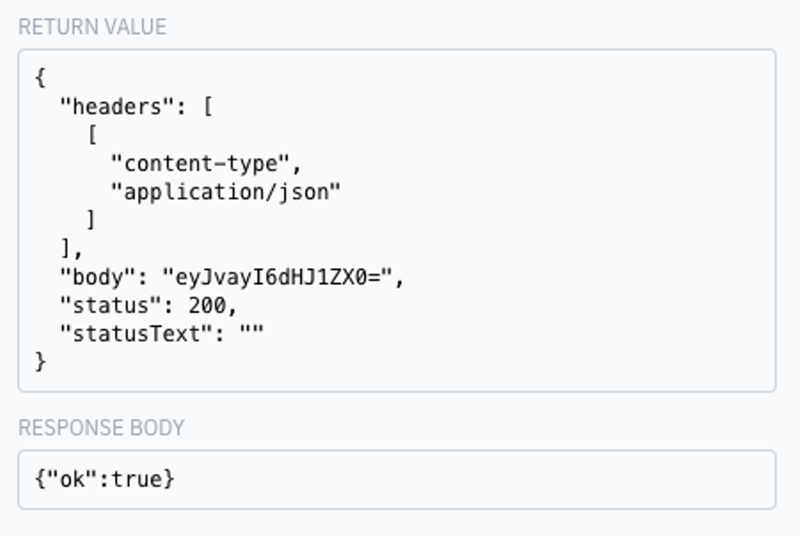

We’re [on Product Hunt](https://www.producthunt.com/posts/val-town)! Please show us some love [by leaving a review](https://www.producthunt.com/products/val-town/reviews/new) ❤️🙏

August was a busy month! We announced our plans for the Runtime v3, totally revamped how you build API endpoints on Val Town with our new web-standard Web API, added another column on desktop so you can view multiple vals side-by-side, “public but unlisted” vals for private-ish use-cases, TypeScript intelligence generally available, notifications when folks comment or like your vals, the ability to properly fork vals, dark mode, and many more features and fixes, a bunch of tutorials, blogs, videos, podcasts, and did I mention [we’re live on Product Hunt right now](https://www.producthunt.com/posts/val-town)?

## Val Town is on Product Hunt

If you’re reading this on Sept 5th, then we would [love your support on Product Hunt](https://www.producthunt.com/posts/val-town)! Show off some of your cool vals, tell a story, or give us some feedback. We’d really appreciate you helping new folks discover us [by leaving a review](https://www.producthunt.com/products/val-town/reviews/new) ❤️


## Blogs, podcasts, tutorials

## Runtime v3 is in development

We recently wrote about [issues with our current runtime, and how the v3 runtime is going to correct them.](https://blog.val.town/blog/val-town-runtime-v3-my-mistakes-were-easy-the-solutions-simple) We’re moving away from custom JavaScript features in favor standard JavaScript, made delightful with editor support. What was implicit and magical will become explicit and robust — but keeping the magical ~vibes~ without the headaches.

A snippet of code from the current v2 runtime:

```tsx
let result = await @stevekrouse.fetchJSON("...")
console.email(result)
```

Our plan for the v3 runtime:

```tsx
import { fetchJSON } from "vt/stevekrouse/fetchJSON";
import { email } from "vt/std/email";

let result = await fetchJSON("...");
email(result);
```

You’ll notice the absence of the `@` symbol and standard imports (via import maps). [Read more here](https://blog.val.town/blog/val-town-runtime-v3-my-mistakes-were-easy-the-solutions-simple), and let us know what you think. We know we’re removing some of your favorite features, but we are confident we can replace them with web-standard equivalents that you’ll like just as much or more!

## Ain’t No Party Like A JavaScript Party

We featured on a recent episode of JSParty and talked about all things Val Town including where the idea came from, how vals are discovered and interact and our tech stack.

<audio data-theme="day" data-src="https://changelog.com/jsparty/287/embed" src="https://op3.dev/e/https://cdn.changelog.com/uploads/jsparty/287/js-party-287.mp3" preload="none" class="changelog-episode" controls></audio><p><a href="https://changelog.com/jsparty/287">JS Party 287: Take me to Val Town</a> – Listen on <a href="https://changelog.com/">Changelog.com</a></p><script async src="//cdn.changelog.com/embed.js"></script>

## Steve on Scaling Devtools

My podcast tour finishes up strong with an episode with Jack Bridger, focused a bit more on the business side of things.

<div class="not-content">
  <lite-youtube videoid="tUXXANGzE1I">
    &#x20;
  </lite-youtube>
</div>

## Discord Bot Tutorial

We’ve been making it easier than ever to get started hosting a Discord bot on Val Town. We now have [a new tutorial](https://docs.val.town/discord-bot-that-replies-to-slash-commands) and video.

<div class="not-content">
  <lite-youtube videoid="yYXmInPSSfg">
    &#x20;
  </lite-youtube>
</div>

### Handling `<form>` data

We released a quick tutorial about handling HTML Form data using vals, which is perfect for static sites.

<div class="not-content">
  <lite-youtube videoid="AEaYaWf5B-I">
    &#x20;
  </lite-youtube>
</div>

### Val Town 🤝 GPT

We wrote a guide on [fine-tuning a ChatGPT-3.5](https://blog.val.town/blog/an-introduction-to-openai-fine-tuning) model for use in your own domains. It’s not quite the right time for Val Town to head in this direction, but we’re actively working on getting LLMs to help you write vals.

## Changelog

### Web API

We released our new [Web API](https://docs.val.town/api/web), the future of building servers on Val Town. A Val conforms to the Web API interface when it:

1. accepts a [Request](https://developer.mozilla.org/en-US/docs/web/api/request)
2. returns a [Response](https://developer.mozilla.org/en-US/docs/web/api/response)

That’s it! We love it and we think it’s a huge step forwards towards building Vals that adhere to web standards and run anywhere.

Here are a couple of examples to see how simple yet powerful it can be:

<div class="not-content">
  <iframe src="https://www.val.town/embed/tmcw.jsonOkExample" width="100%" frameborder="no" style="height: 400px;">
    &#x20;
  </iframe>
</div>

<div class="not-content">
  <iframe src="https://www.val.town/embed/tmcw.honoExample" width="100%" frameborder="no" style="height: 400px;">
    &#x20;
  </iframe>
</div>

### Unlisted Vals

For your vals that need to be open to the internet but not discoverable on Val Town by anyone, we have the new “Unlisted” mode. This complements the Private and Public modes and can be changed using the same switch.


### Sidebar & Val Previews

There was a lot of feedback on our New Val button, and how it opens up in a modal that obscure other vals. We took that feedback to heart, and Tom prototyped a bunch of other solutions, and we finally landed on one we’re really happy with:

1. Preview of vals when hovering over @references
2. Pinning vals to a sidebar (from the preview or the … menu)

The pinned vals column is resizable by dragging its border. Note that this is desktop-only, since there’s not quite enough room for two panes on a phone.

[https://cdn.discordapp.com/attachments/1020432421243592717/1143604665087447100/CleanShot_2023-08-22_at_13.54.22.mp4](https://cdn.discordapp.com/attachments/1020432421243592717/1143604665087447100/CleanShot_2023-08-22_at_13.54.22.mp4)

### Types for everyone

We recently added TypeScript editor support, but it was buggy and slow, so we kept it as an opt-in beta feature. However, we polished it up, and moved it to a web worker, freeing up the main thread to keep our UI nice and snappy. We moved it out of beta, so now everyone will get lovely type support throughout Val Town.

<video src="./capture.mp4"></video>

### Val Templates

Now when you create a new val, you get a handy list of templates to get you started. We’re particularly excited for how this can help new users discover what they can make in Val Town. This feature also foreshadows one of our most exciting UI improvements coming soon…



### Notifications

We’re building out proper notification infrastructure. We’ve got comments, likes, and references so far. Look out for forks, mentions, and errors — as well as push notifications via email & webhook coming soon!


### Email _anyone_ from Val Town

Val Town Pro users can now email **\*\***anyone**\*\*** from Val Town. This opens up lots of possibilities for creating more dynamic services on Val Town. Check out [`@std.email`](https://www.val.town/v/std.email), and these [email](https://www.val.town/v/stevekrouse.emailGPT3) [bots](https://www.val.town/v/andreterron.dallemail) for ideas. This val is a small taste of how we’ll make APIs like console.email web standard. It’s a bit clunky at the moment, but we have lots of ideas on how to improve it.


### READMEs and Comments get images and references

A picture paints a thousand words, so keep your READMEs and comments easy to understand by adding some with our new drag-and-drop image functionality.

[Screen_Recording_2023-08-16_at_4.05.43_PM.mov](../val-town-newsletter-12/screen_recording_2023-08-16_at_40543_pm.mov)

### Fork vals

At long last, you can **_properly_** fork a val, and have its provenance tracked in the database. Before we just added a `// Forked from @someones.val` comment at the bottom of forked vals. We also migrated as many of those old-style forked vals over as possible. Now a forked val has a little icon in the bottom left of the val. You can also fork your own val — the option to do so is in the **…** menu.


### Dark mode

Val Town now has Dark mode! There’s also Auto mode to assume the system setting. We’re one of the cool kids now 😎

[CleanShot_2023-08-15_at_18.18.25.mp4](../val-town-newsletter-12/cleanshot_2023-08-15_at_181825.mp4)

### Val Town Universe

Tom created [Val Town Universe](https://www.val.town/universe), a way to explore vals and their connections visually.


Val Town wouldn’t be a social site without tagging, so now you can tag people in Val READMEs and comments.

[tagging.mp4](../val-town-newsletter-12/tagging.mp4)

### Response body decoded

When your web val returns a `Response`, it technically could be anything (ie binary) so we show the base64 encoded value. However that’s annoying when you know it’s just text, ie HTML or JSON. Now we show you the parsed response body when available.



### Embed vals in Notion

Copy and paste a val link to Notion to embed it. (Before you had to specifically copy the “Embed Link”, but now it auto-converts any val link.) Thanks, friends at Notion and Iframely!

[nfIYBRcfQwIFB98K.mp4](../val-town-newsletter-12/nfiybrcfqwifb98k.mp4)

### Misc

- The app now opens val references without opening a new tab by default.
- Feedback button has been reintroduced to the navbar.
- The favicon is outlined in white so you can see it in dark browsers
- Updated Codemirror
- Updated Deno to [1.36.2](https://github.com/denoland/deno/releases) (from 1.35)
- Improvements in handling tooltips, tabbing, and dialog interactions.
- Rotated the three dots menu from vertical to horizontal
- Refined various APIs, and shipped the new references API, runs API and val versions API

## Roadmap

- Runtime v3
- Transpiler (Runtime v2 → v3)
- Notifications (forks, errors, mentions, push to email & webhook)
- Pull Requests
- Custom domains
- AI generated vals
- Val Types (ie Web API val, function val, JSON val, with UI clarifications for each)
- Improvements to embedded val

## 😎 Cool Vals

- [@karfau](https://val.town/karfau) created a val that [approves GitHub dependency PRs from bots](https://www.val.town/v/karfau.githubWebhookApproveDependencyPRs), [a test runner](https://www.val.town/v/karfau.testRunner), and [a](https://www.val.town/v/karfau.getRaw) [whole](https://www.val.town/v/karfau.mainReference) [lot](https://www.val.town/v/karfau.isRequest) [of](https://www.val.town/v/karfau.rawUrl) [helper](https://www.val.town/v/karfau.refToValUrl) [vals](https://www.val.town/v/karfau.debug)
- [@jordan](https://val.town/jordan) built a [bluesky RSS bot](https://www.val.town/v/jordan.bsky_rss_poll) that posts things from an RSS feed to bluesky for you, and a fantastic [blog post](https://notes.jordanscales.com/d4bd10aa) that uses vals to explain how country flag emojis work
- [@sdan](https://val.town/sdan) made [functioncalling.fun](https://functioncalling.fun/), a site that lets you use the power of Val Town functions for calling OpenAI
- [@neverstew](https://val.town/neverstew) whipped up this [Val Town Search](https://valtown-search.fly.dev/) site that lets you search across vals with a fuzzy matcher
- [@zackoverflow](https://val.town/zackoverflow) made, an [RSS → email](https://www.val.town/v/zackoverflow.pollRssAndEmail) val, [a lisp](https://www.val.town/v/zackoverflow.lisp) (🤯 I know!?), and [a tiny implementation of zod](https://www.val.town/v/zackoverflow.minizod) designed for Val Town
- [@fil](https://val.town/fil) created [a beautiful earthquake map that updates itself daily](https://www.val.town/v/fil.earthquakes) and [a bluesky bot](https://www.val.town/v/fil.cron_rezo_rss2bsky)
- [@tmcw](https://val.town/tmcw) made a val that [monitors for changes in California business records](https://www.val.town/v/tmcw.californiaBusinessNotifications), and used a val to [explore and explain why HTTP responses say “OK” or “Not Found”](https://www.val.town/v/tmcw.reasonPhrase)
- [@andreterron](https://val.town/andreterron) crafted [the world’s simplest DallE email bot and](https://www.val.town/v/andreterron.dallemail) [the world’s most annoying ~~twitter~~ X bot](https://www.val.town/v/andreterron.actuallyItsXBot)
- [@maas](https://val.town/maas) made a simple way to create [anonymous email addresses for yourself](https://www.val.town/v/maas.forwarder) and a val to [import your gists into Val Town](https://www.val.town/v/maas.importGists)
- [@stevekrouse](https://val.town/stevekrouse) made an [email chatbot](https://www.val.town/v/stevekrouse.emailEcho), made [the world’s simplest GPT email bot](https://www.val.town/v/stevekrouse.emailGPT3), [a val in python](https://www.val.town/v/stevekrouse.jsPython), [made a website inside a tweet](https://twitter.com/stevekrouse/status/1687472712803897344), and [wikidata joke site to let us all know if someone is still alive](https://stevekrouse-living.web.val.run/Henry%20Kissinger)
- [@buttondown](https://val.town/buttondown) created a val that [alerts you about new bluesky posts](https://www.val.town/v/buttondown.runner) matching any keywords you define
- [@jdan](https://val.town/jdan) created a site that [lists every emoji](https://www.val.town/v/jdan.emojiweb)
- [@zhanghaili0610](https://twitter.com/zhanghaili0610) created [a tweet thread](https://twitter.com/zhanghaili0610/status/1686685750778384384) with lots of vals as a quick reference for anyone into LangChain AI
- [@mikker](https://val.town/mikker) uses Val Town to get their [daily “what did you work on today?” reminder in Slack](https://www.val.town/v/mikker.dailySlackRoundup)
- [@pomdtr](https://www.val.town/u/pomdtr) [extended the val run API](https://www.val.town/v/pomdtr.run), [made an endpoint to get raw val text](https://www.val.town/v/pomdtr.raw), [extract the args from a val](https://www.val.town/v/pomdtr.extractValArgs), and [showed us a cleaner way to write html in vals](https://www.val.town/v/pomdtr.vanPlateExample)
- [@kognise](https://www.val.town/u/kognise) [sends herself daily happiness checkin emails](https://www.val.town/v/kognise.sendDailyValenceEmail), and [a little website to help her find buses to work](https://www.val.town/v/kognise.workBusesGui)
