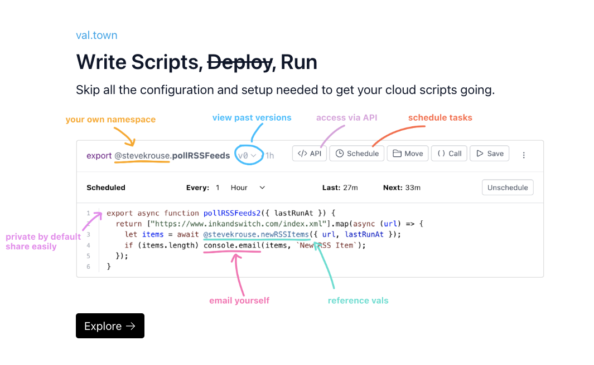

Our Show HN had an great reception, we loved what you all did with the tool, we closed two security vulnerabilities, made lots of little improvements to the site, and officially added a fourth to the team! We’re focused on bugs, stability, and security for the next couple weeks.

## Welcome HN 👋

We did a [Show HN](https://news.ycombinator.com/item?id=34343122) the Wednesday before last. If you’re a new friend from HN, welcome!

Probably the best way to get started in Val Town is to fork one of our popular vals:

- [Get email notifications when someone you “follow” posts on Hacker News](https://www.val.town/stevekrouse.hnFollowPollJob)
- [Get email notifications from RSS feeds you care about](https://www.val.town/stevekrouse.pollRSSFeeds)
- [Get notified to close your window when the air quality is bad in SF (during fire season)](https://www.val.town/stevekrouse.aqi)
- [Remind yourself to work out](https://www.val.town/gaetgu.remind_myself)
- [Keep tabs on your favorite reclusive researcher on Github](https://www.val.town/stevekrouse.githubNotification)

Val Town quite good at these [“Programmatic Notification”](../val-town-newsletter-1) tasks.

Please jump into the Discord with any questions or DM me (steve@val.town). We’re eager to help and hear your feedback.

## Cool Vals 🤩

The ultimate joy of a toolmaker is having the tool used in unexpected and delightful ways! Here’s some of my favorites:

- A full chat app with a UI, using val town as backend and database
  [https://api.val.town/express/@nimalu.chat](https://api.val.town/express/@nimalu.chat)

- Get rich by keeping tabs on when Congress members are trading stocks
  [https://www.val.town/claytn.fetchCongressTradeReports](https://www.val.town/claytn.fetchCongressTradeReports)

- A gallery of “variable power” cards in Magic the Gathering
  [https://api.val.town/express/@stevekrouse.variablePower](https://api.val.town/express/@stevekrouse.variablePower)
  (forked from [https://www.val.town/@tionis.variablePower](https://www.val.town/@tionis.variablePower))

- A Slack slash command to eval a [val.town](http://val.town) expression
  [https://www.val.town/nate.slackapp](https://www.val.town/nate.slackapp)

- A reminder to pray
  [https://www.val.town/shaya.keriatShemaReminser](https://www.val.town/shaya.keriatShemaReminser)

- Some fun with GPT!
  [https://api.val.town/eval/@nate.kindness()](<https://api.val.town/eval/@nate.kindness()>)
  [https://www.val.town/patrickjm.aiSarcasticMotivationalMessage](https://www.val.town/patrickjm.aiSarcasticMotivationalMessage)
  [https://www.val.town/patrickjm.weatherTomorrowGpt3Example](https://www.val.town/patrickjm.weatherTomorrowGpt3Example)

- Sending a message via the Telegram API
  [https://www.val.town/victor141516.sendTelegramMessage](https://www.val.town/victor141516.sendTelegramMessage)

- Working with the Reddit API
  [https://www.val.town/mschleske.fetchRedditToken](https://www.val.town/mschleske.fetchRedditToken)

- Using Replit’s Database
  [https://www.val.town/claytn.createReplitDBClient](https://www.val.town/claytn.createReplitDBClient)

- One of the longest vals I’ve ever seen

  

    <iframe src="https://www.val.town/catapart.magnitTokenize" width="100%" frameborder="no" style="height: 400px;">
      &#x20;
    </iframe>
  

- Using a URL shortener
  [https://www.val.town/demo.shortenUrl](https://www.val.town/demo.shortenUrl)

## Show HN Recap

We were hoping to be on the front page of Hacker News all day, and we were! While we never cracked the top 3, we were hovering around #5 all day, got 331 upvotes and 71 comments. Possibly the most exciting fact about our launch was how positive everyone on HN was! I’d like to give a special shout-out to Dan G from HN, who gave us great tips on how to launch.

In approximate numbers, we had 20k new visitors this month, with the majority coming during the Show HN, but still a much higher baseline (300/ day) than we had previously (50 / day). We had 250 users before our Show HN and gained 1000 afterwards, so our total user base is 1250. We’re up to almost 200 in our Discord community, and the majority of those are post-launch but I don’t know how many.

We have about 100 users who have run code more than 30 times and another 100 who have run code more than 10 times. This means we have about 1000 people who churned off the product fairly quickly after signing up. This means we struck a nerve with folks enough to give us their email, but we have a lot more to do to help them be successful with the tool.

## Changelog

- New homepage, explaining Val Town & “vals”

  

- Redesigned Val Cards, lots of small UI upgrades everywhere, uniform styles, icons

- Reorganized the top-line navigation around Home / Explore / Tips

- A new “Featured Vals” section on the “Explore” tab

- Removed the “New Val” button in favor of always showing an editor for writing a new val

- Added a “New folder” button

- \~50 tiny fixes, including major refactors to pay down tech debt

## Security

We encountered one medium-severity and [one critical-severity](../security-disclosure-1) security vulnerability. We immediately fixed the vulnerabilities and paid out bug bounties to the reporters. We are talking to Hacker One about setting up a more formal bug bounty program. We have also made it our #1 priority to switch to a more secure sandboxed runtime (possibly Deno) for running user code. We hope to make the switch in the next week or two.

## Roadmap

We feel that the roadmap is fairly straightforward for us over the next couple of months. The product has some rough edges we need to smooth out: sandboxing, janky semantics around mutable state, public vs private vals, val versioning, better documentation, etc. Although we know a lot about these problems, please keep reporting them as you see them so we know which are the highest priority. We have a new #bugs forum channel in [our Discord](https://discord.gg/dHv45uN5RY) that we’d love to hear from you in!

There are some really exciting features many users have been asking for: npm imports, “backlinking” so you can see how your vals are used by others, OAuth for instant access to common APIs like Twitter, GSuite, Discord, Slack, etc.

Please jump into our Discord if you have suggestions on how to make the product better.

Happy coding!

Steve

## Subscribe

The easiest way to subscribe to Val Town is to **sign up for an account on [val.town](http://val.town)**, and then opting in to receive our newsletter as your set your username. You can also sign up [via this link](https://cdn.forms-content.sg-form.com/6c6893f3-38e6-11ed-b573-a6c391c68d4b).
