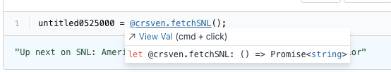

Founding team, assembled! Cool users continue to sign up and make cool vals. We
made many small things better, and are working on making a few big things
amazing. Deno, npm, omniscient debugging, and superjson hopefully soon!

If you’re new to the Val Town journey, check out
[our earlier blogs](..//val-town-blog) or just
[go to try out the product.](https://val.town)

### Founding team

We doubled in size (from 2 to 4) last month, so I wanted to take a moment just
to gush about how lovely my colleagues are:

- _André Terron_ was Val Town’s first passionate user, and became Val Town’s
  first employee. He’s been kicking butt from Seattle since he joined in Oct.
  He’s pushed many of your favorite features including typescript, autocomplete,
  secrets, hnfollow.com, scheduled vals, and maintained our complex runtime
  semantics. He’s always concerned about doing the right thing by our users,
  particularly around security and privacy.
- _Rodrigo Tello_ has been a friend since we met at when I visited
  [Hopscotch](https://www.gethopscotch.com/) ~7 years ago. He is a designer who
  is passionate about democratizing computation and fluent in Alan Kay
  references. He has been helping out over the past few months, and finally
  decided to join full time in January. He designed our
  [beloved, simple new landing page](https://val-town.notion.site/image/https%3A%2F%2Fs3-us-west-2.amazonaws.com%2Fsecure.notion-static.com%2Ffd1c6b0b-7b8b-44d8-b511-bf99afbc0089%2FScreenshot_2023-01-18_at_12.01.43_PM.png?id=0f30c451-936d-4d49-9024-2fd491a1e36b&table=block&spaceId=915abc6a-f726-4044-a2cf-f5262b44b4d0&width=2000&userId=&cache=v2)
  in a couple hours, the day-of our launch, and has been quietly shipping clean,
  beautiful designs since.
- _Tom MacWright_ has been a friend and mentor to me for years. I’ve long
  admired his insightful blog and pragmatic technical taste that perfectly
  balances maintainability over the long-term while still being on the
  cutting-edge. I’d often DM him on Twitter for advice on which JS library to
  use. Now I just turn to my left 😱. It felt like he professionalized our
  entire codebase in his first two weeks on the job.
- _Steve Krouse (me) -_ Who let this guy in? I can’t say anything nice about
  myself, so you’ll have to read [my website](https://stevekrouse.com/) or
  [my research journal](http://futureofcoding.org/log) and come up with your own
  nice things to say about me.
- _Dan, Ross (advisors) -_ I’d be remiss if I didn’t include Dan and Ross in the
  founding team. Dan instigated this whole project over the summer, and
  introduced me to Ross who has been advising us since the beginning. They are
  both very generous with their time and wisdom.

It still feels surreal how quickly the founding team has come together. Even
more unlikely is that three of us live within two miles of each other in
Brooklyn! We decided to go old-school with a beautiful office in the Brooklyn
Navy Yard.

We’ve got some extra desks, so please reach out & stop in if you find yourself
in town and want to hack on some vals in the val factory.

### Cool vals 😎

We’re in a new phase of the company: y’all sign up on your own, figure things
out, build stuff, read the docs, and move on with your lives, without me
involved at all. Gone are the days where I had to onboard my friends by hand.
New people sign up every day and make cool things, with all sorts of APIs:
[reddit](https://www.val.town/bnorick.check_reddit),
[github](https://www.val.town/@tzq.monitoringGitHubRepository) (including
[one I made for Rodrigo](https://www.val.town/stevekrouse.valTownStyleGuideUpdated)),
[leetcode](https://www.val.town/LavaC.getLeetcodeCnNextDailyQuestion),
[water services](https://www.val.town/eczajk.usgsSite),
[pokemon](https://www.val.town/gabby.getRandomPokemon),
[telegram](https://www.val.town/smalldogenergy.tgEchoWebhook),
[tor](https://www.val.town/ofalvai.checkMyTorRelay),
[sunrise/sunset](https://www.val.town/eczajk.sunriseSunset),
[random french products](https://www.val.town/jte.svSearch),
[bullet journal](https://www.val.town/eczajk.bulletJournalMonth),
[porn](https://twitter.com/stevekrouse/status/1620827196301660160),
[binance](https://www.val.town/oske.fetchBinance),
[snl](https://www.val.town/crsven.fetchSNL),
[discogs](https://www.val.town/axelav.discogs),
[lark](https://www.val.town/tzq.sendLarkMessage), and many many more in private
vals… Please reach out if you make something cool or see someone else who does!

### Changelog

### TypeScript info on hover

It may seem like a small thing, but this was one of the things I missed most
from VSCode. Andre added it shockingly quickly.

### Increased security for val tracing

Calling someone else’s val function is like calling their API. By that logic,
they should be able to read any parameters you give that function. However this
logic breaks down when someone uses a utility library to call an API that
requires an API key. So in order to better comply with programmer’s pre-existing
intuitions around how using libraries work, we now only show you tracing for
evaluations where you were the person who trigger the evaluation _and_ you are
the owner of the val in question. Unfortunately this means that you won’t get
tracing for vals that others run or for vals you don’t own, which will encourage
folks to fork more vals to their own namespaces. We will continue to iterate on
these permissions… Thanks Pat for bringing this issues to our attention!

### Filters for private, public, interval vals

This is of Rodrigo’s first big designs at Val Town and it was implemented by
Andre. Currently it only filters within your current folder, which is terribly
limiting. We’re working on a new UI for val search across folders and users.

### & much more!

- Upgraded to supabase v2 JS SDK & generated types, so our codebase is more
  type-safe
- Added point in time recovery to our database. Supabase missed the scheduled
  time, but then was able to do the upgrade without any downtime. Sorry about
  the confusion!
- Added a unique index on val versions in database
- Lots of little ui improvements, loading states, scroll bars, little
  optimizations and bug fixes

### Now

### _Deno (& npm!)_

As mentioned previously, we’re switching to a more secure runtime and it
increasingly looks like it’ll be Deno. And it seems that if/when it lands, we’ll
get npm imports for free. (Those that are compatible with deno, anyways.) Our
two most important features in one fell swoop! However this is a fairly huge
rewrite, so it may take Tom couple more weeks.

### _Tracing/Determinism/Omniscient Debugging_

One of our biggest worries in general (but particularly related to switching the
runtime to Deno) is breaking user code that used to work. I’ve long dreamt of
one day being able to use all past user code executions as a massive test suite
that we can run new runtime code against. All we have to do is track all sources
of IO (non-determinsm) and when we replay your past code, we’ll replace any
calls to Date, Math.random and fetch with the values we recorded from when your
code originally ran. Another upside of remembering all the things is to have a
perfectly deterministic platform, so we can provide all of you with an
omniscient debugging experience, that makes logging to the console unnecessary;
you could always add any logs you wanted in the past retroactively! Andre has
been recording your random numbers since yesterday and hopefully your fetch
calls by tomorrow.

### Val Permissions UI

New users are constantly confused about which of their vals are public or
private. Rodrigo is working on making all this clearer in the UI.

### & more!

In case you were wondering, I still do stuff. I’ve got materialized views to
optimize and proxies to configure. It’s been one of my pet projects to make your
`fetch` requests more resilient and error-free than if you ran them outside of
Val Town… but more on that in another newsletter!

### Soon

### JSON++

Currently vals are only either functions or JSON. We all desperately want many
more types of vals, like `Date`, `Set`, `Map`, `Object`, `Regex`, `Error`...
We’re looking very seriously at
[superjson](https://github.com/blitz-js/superjson). Will we ever serialize
closures? A boy can dream.

### Fixing mutable state bugs

The most embarrassing parts of Val Town is where we fall down on our promised
semantics. We are trying to give you a collaborative JS REPL that is never
turned off and that you can share with anyone in the world. As discussed above,
one way this promise is betrayed is by not yet serializing enough kinds of
values. But even more embarrassing is how our global `@me` mutable state
implementation differs from your expectations of how it works in normal,
single-threaded JavaScript. I won’t go into all the details here, but our friend
Ross has helped me work out a locking semantics that we think will get us there,
and can scale reasonably well.

### Renames

You can’t rename a val in Val Town. You can just create a new val with a new
name. But sometimes a rename is what you want to do. Inspired by
[Unison](https://www.unison-lang.org/), we are moving towards a system where
names are treated like metadata, so you will be able to seamlessly rename all
your vals, without breaking any dependents, in your code or others’! Andre has
got some great designs in place…

### 🙏 Tell us what you want

All of our best features have come from your requests and complaints, so keep em
coming!

Happy coding!

Steve

### Subscribe

The easiest way to subscribe to Val Town is to _sign up for an account on
[val.town](https://www.val.town)_, and then opting in to receive our newsletter
as your set your username. You can also sign up
[via this link](https://cdn.forms-content.sg-form.com/6c6893f3-38e6-11ed-b573-a6c391c68d4b).
