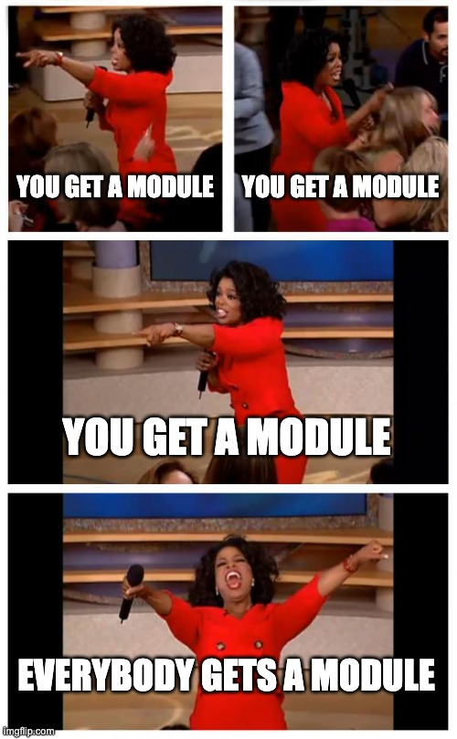
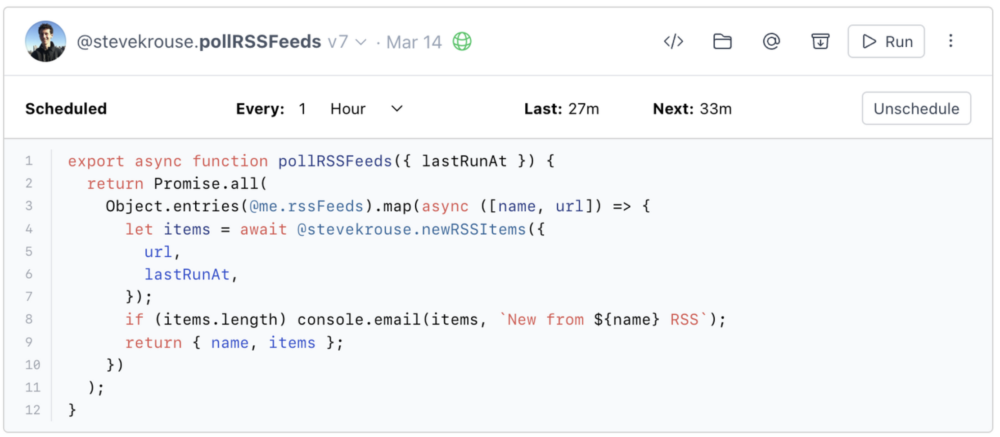
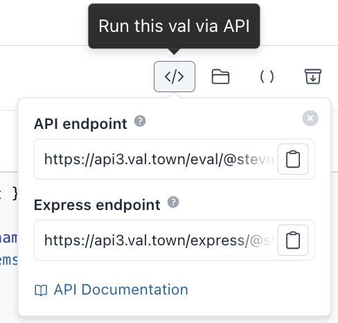

We shipped our new Deno runtime! We launched imports, from npm, esm.sh, deno.land. Our next focus is on quick wins, particularly in social directions. Y’all continue to dazzle us with very cool vals 🤩

### Changelog

### Deno

We embarked on the migration to Deno mostly for security reasons, but also because they have incredibly sexy imports via URL (although it’s ironic to say that today because they finally [conceded to adding an optional package.json](https://deno.com/blog/package-json-support) to deno). I was hoping that the migration would only take 2-4 weeks but it took 6. Looking back on it, we are lucky it only took 6 weeks! It was a grueling migration, because porting a runtime is an incredibly difficult task, particularly when it was built quickly and without many tests. Tom rebuilt it almost entirely from the ground up, for security, and long-term maintainability. His experience working on similar projects at Observable was key here. Now we’re on much more stable and organized footing. And we have lots of tests!

We have almost 200 active user intervals running now, and I migrated over each one by hand to the new runtime, and babysat it for a few runs to make sure we didn’t cause any new bugs. Special thanks to [Kartik](http://akkartik.name/) ([@akkartik](https://www.val.town/akkartik)) for being our volunteer to test the new runtime and for his patience when we ran into a couple snags.

The award for best Val Town user this month clearly goes to [Andrew Healey](https://healeycodes.com/) ([@healeycodes](https://www.val.town/healeycodes)) for his tireless work trying to outwit our and Deno’s sandboxing. He’s up to maybe 5 exploits so far. So hats off to Andrew for keeping us all secure 🙏 If you’re interested in the challenges of sandboxing JavaScript, I highly recommend his article [Sandboxing JavaScript Code](https://healeycodes.com/sandboxing-javascript-code).

You can read the full [Upgrade to Deno guide here](https://docs.val.town/upgrade-to-deno-march-14-2023).

### Imports

As alluded to, Deno comes with this amazing import syntax that fits so well into the Val Town model. I shudder to think of a full `package.json` in a val. We may have to do it some day but hopefully not soon! After we launched Deno, it only took Tom about an afternoon to launch the first version of imports 🥳

  <iframe src="https://www.val.town/embed/stevekrouse.npmExample" width="100%" frameborder="no" style="height: 400px;">
    &#x20;
  </iframe>

  <iframe src="https://www.val.town/embed/stevekrouse.denoImportEx" width="100%" frameborder="no" style="height: 400px;">
    &#x20;
  </iframe>

### Refreshed Val Header

We didn’t set out to entirely redesign val headers this month, but we kinda did, piece by piece:

Original Val

Refreshed Val

Public vs private is a lot clearer now, and how to switch between them.

We added profile pictures (from GitHub & Gravatar).

The Archive button is a simple way to get vals out of your line of sight without deleting them forever.

We simplified the API menu, including a URL to express endpoints.

In order to make room for all our buttons, we made them icons only, and their description lives in tooltips now.

### Refreshed Tips Menu

- Bug fixes around moving vals in your workspaces & deleting vals

### Refresh to the Tracing UI

A lot of folks probably don’t even know that Val Town comes with tracing built in. We automatically track all evaluations of any val, including every time your function is run, and show you all those evaluations on the val’s page at the bottom. For security concerns, we only show you evaluations on vals that you own and that you were the initiator of the run. So if someone else calls your val, you won’t see the evaluation history for that run. Tom made a number of small UI tweaks to the evaluations UI, including these cute green checkmarks when no errors are thrown.

### `api2.val.town` & `api3.val.town`

You may have noticed that our API URL sometimes is displayed as `api.val.town`, `api2.val.town` or `api3.val.town`. Apologies for the confusion! They all go to the same place. We needed to make a couple different subdomains and we moved our infrastructure around last week. We will soon reconsolidate them back to simply just `api.val.town`, but continue to support `api2` and `api3` as symlinks to `api.val.town` in perpetuity.

### Roadmap

We are focused on quick wins, better onboarding, and social features over the next couple weeks. We’re thinking about improved auth, better search, dynamic featured vals, profile page customization & hero stats, comments, liking and mini pull requests on vals, pretty val share URLs, public folders, seeing & getting notifications about your vals’ usage, and much more.

### Cool vals

[https://twitter.com/stevekrouse/status/1637890851031359517](https://twitter.com/stevekrouse/status/1637890851031359517)

[https://twitter.com/stevekrouse/status/1638937904087982086](https://twitter.com/stevekrouse/status/1638937904087982086)

[https://twitter.com/stevekrouse/status/1638936182838132736?s=20](https://twitter.com/stevekrouse/status/1638936182838132736?s=20)

[https://twitter.com/stevekrouse/status/1638158128473600002?s=20](https://twitter.com/stevekrouse/status/1638158128473600002?s=20)

[https://twitter.com/dvddkkim/status/1635850605435707392?s=20](https://twitter.com/dvddkkim/status/1635850605435707392?s=20)

[https://twitter.com/stevekrouse/status/1638930095585779712](https://twitter.com/stevekrouse/status/1638930095585779712)

  <iframe src="https://www.val.town/embed/thesephist.internalStreamThesephistComRSS" width="100%" frameborder="no" style="height: 400px;">
    &#x20;
  </iframe>

  <iframe src="https://www.val.town/embed/libo.denoImportEx" width="100%" frameborder="no" style="height: 400px;">
    &#x20;
  </iframe>

  <iframe src="https://www.val.town/embed/Glench.tvshows" width="100%" frameborder="no" style="height: 400px;">
    &#x20;
  </iframe>

  <iframe src="https://www.val.town/embed/yuuza.btrdb_kv_example" width="100%" frameborder="no" style="height: 400px;">
    &#x20;
  </iframe>

  <iframe src="https://www.val.town/embed/z233.bebopBotWebhook" width="100%" frameborder="no" style="height: 400px;">
    &#x20;
  </iframe>

  <iframe src="https://www.val.town/embed/chet.watchAceOfSpades" width="100%" frameborder="no" style="height: 400px;">
    &#x20;
  </iframe>

  <iframe src="https://www.val.town/embed/csshsh.weather" width="100%" frameborder="no" style="height: 400px;">
    &#x20;
  </iframe>

  <iframe src="https://www.val.town/embed/juliendorra.geolocation" width="100%" frameborder="no" style="height: 400px;">
    &#x20;
  </iframe>

  <iframe src="https://www.val.town/embed/Glench.wholefoodssales" width="100%" frameborder="no" style="height: 400px;">
    &#x20;
  </iframe>

  <iframe src="https://www.val.town/embed/winnie.myTsundokuJournal" width="100%" frameborder="no" style="height: 400px;">
    &#x20;
  </iframe>

  <iframe src="https://www.val.town/embed/rodrigotello.myBirthday" width="100%" frameborder="no" style="height: 400px;">
    &#x20;
  </iframe>

  <iframe src="https://www.val.town/embed/brenton.isUp" width="100%" frameborder="no" style="height: 400px;">
    &#x20;
  </iframe>

  <iframe src="https://www.val.town/embed/russbiggs.nowcastPMAqi" width="100%" frameborder="no" style="height: 400px;">
    &#x20;
  </iframe>

  <iframe src="https://www.val.town/embed/ryanbateman.getLocationsForRSSItems" width="100%" frameborder="no" style="height: 400px;">
    &#x20;
  </iframe>

  <iframe src="https://www.val.town/embed/winnie.fetchBookmarksFromMastodon" width="100%" frameborder="no" style="height: 400px;">
    &#x20;
  </iframe>

  <iframe src="https://www.val.town/embed/winnie.api_books" width="100%" frameborder="no" style="height: 400px;">
    &#x20;
  </iframe>

  <iframe src="https://www.val.town/embed/chet.frostWarningCron" width="100%" frameborder="no" style="height: 400px;">
    &#x20;
  </iframe>

  <iframe src="https://www.val.town/embed/patrickjm.gpt3Example" width="100%" frameborder="no" style="height: 400px;">
    &#x20;
  </iframe>

  <iframe src="https://www.val.town/embed/patrickjm.chatGptExample" width="100%" frameborder="no" style="height: 400px;">
    &#x20;
  </iframe>

  <iframe src="https://www.val.town/embed/patrickjm.chatGpt" width="100%" frameborder="no" style="height: 400px;">
    &#x20;
  </iframe>

  <iframe src="https://www.val.town/embed/patrickjm.gpt3" width="100%" frameborder="no" style="height: 400px;">
    &#x20;
  </iframe>

  <iframe src="https://www.val.town/embed/patrickjm.openAiFreeUsage" width="100%" frameborder="no" style="height: 400px;">
    &#x20;
  </iframe>

  <iframe src="https://www.val.town/embed/cole.dailyCat" width="100%" frameborder="no" style="height: 400px;">
    &#x20;
  </iframe>

  <iframe src="https://www.val.town/embed/cole.fetchCat" width="100%" frameborder="no" style="height: 400px;">
    &#x20;
  </iframe>

  <iframe src="https://www.val.town/embed/rlesser.espntcFindUserGroups" width="100%" frameborder="no" style="height: 400px;">
    &#x20;
  </iframe>

  <iframe src="https://www.val.town/embed/mepuka.logToRWGPS" width="100%" frameborder="no" style="height: 400px;">
    &#x20;
  </iframe>

  <iframe src="https://www.val.town/embed/avinash.archiveTheURL" width="100%" frameborder="no" style="height: 400px;">
    &#x20;
  </iframe>

  <iframe src="https://www.val.town/embed/mcwhittemore.quickShareAppPage" width="100%" frameborder="no" style="height: 400px;">
    &#x20;
  </iframe>

  <iframe src="https://www.val.town/embed/mattx.showRequest" width="100%" frameborder="no" style="height: 400px;">
    &#x20;
  </iframe>

  <iframe src="https://www.val.town/embed/mcwhittemore.quickShareExpressQueryTest" width="100%" frameborder="no" style="height: 400px;">
    &#x20;
  </iframe>

  <iframe src="https://www.val.town/embed/markprobst.addRowWebhook" width="100%" frameborder="no" style="height: 400px;">
    &#x20;
  </iframe>

  <iframe src="https://www.val.town/embed/mattx.register_discord_commands" width="100%" frameborder="no" style="height: 400px;">
    &#x20;
  </iframe>

  <iframe src="https://www.val.town/embed/mattx.examplebot_eval" width="100%" frameborder="no" style="height: 400px;">
    &#x20;
  </iframe>

  <iframe src="https://www.val.town/embed/yuuza.btrdbClient" width="100%" frameborder="no" style="height: 400px;">
    &#x20;
  </iframe>

  <iframe src="https://www.val.town/embed/chet.frostNotify" width="100%" frameborder="no" style="height: 400px;">
    &#x20;
  </iframe>

  <iframe src="https://www.val.town/embed/chet.websiteSnapshot" width="100%" frameborder="no" style="height: 400px;">
    &#x20;
  </iframe>

  <iframe src="https://www.val.town/embed/dot.dinnerFuckUp" width="100%" frameborder="no" style="height: 400px;">
    &#x20;
  </iframe>

  <iframe src="https://www.val.town/embed/Glench.wholeFoodsRSS" width="100%" frameborder="no" style="height: 400px;">
    &#x20;
  </iframe>

  <iframe src="https://www.val.town/embed/juliendorra.mockdevices" width="100%" frameborder="no" style="height: 400px;">
    &#x20;
  </iframe>

  <iframe src="https://www.val.town/embed/dot.hackerNotify" width="100%" frameborder="no" style="height: 400px;">
    &#x20;
  </iframe>

  <iframe src="https://www.val.town/embed/roop.speakShows" width="100%" frameborder="no" style="height: 400px;">
    &#x20;
  </iframe>

  <iframe src="https://www.val.town/embed/brandon.hnFollowPollJob" width="100%" frameborder="no" style="height: 400px;">
    &#x20;
  </iframe>

  <iframe src="https://www.val.town/embed/ryanbateman.getShorpyRSS" width="100%" frameborder="no" style="height: 400px;">
    &#x20;
  </iframe>

  <iframe src="https://www.val.town/embed/winnie.emailYourMastodonBookmarks" width="100%" frameborder="no" style="height: 400px;">
    &#x20;
  </iframe>

  <iframe src="https://www.val.town/embed/pauldrifting.handlePulumiMessage" width="100%" frameborder="no" style="height: 400px;">
    &#x20;
  </iframe>

  <iframe src="https://www.val.town/embed/simone.allertaMeteo" width="100%" frameborder="no" style="height: 400px;">
    &#x20;
  </iframe>

  <iframe src="https://www.val.town/embed/ryanbateman.getNotifications" width="100%" frameborder="no" style="height: 400px;">
    &#x20;
  </iframe>

  <iframe src="https://www.val.town/embed/ryanbateman.querystring" width="100%" frameborder="no" style="height: 400px;">
    &#x20;
  </iframe>

  <iframe src="https://www.val.town/embed/patrickjm.fetchReplicateModel" width="100%" frameborder="no" style="height: 400px;">
    &#x20;
  </iframe>

  <iframe src="https://www.val.town/embed/patrickjm.createReplicatePrediction" width="100%" frameborder="no" style="height: 400px;">
    &#x20;
  </iframe>

  <iframe src="https://www.val.town/embed/patrickjm.trackOpenAiFreeUsage" width="100%" frameborder="no" style="height: 400px;">
    &#x20;
  </iframe>

  <iframe src="https://www.val.town/embed/sandbox.convertAUDtoUSD" width="100%" frameborder="no" style="height: 400px;">
    &#x20;
  </iframe>

  <iframe src="https://www.val.town/embed/winnie.fetchBooksFromAPItable" width="100%" frameborder="no" style="height: 400px;">
    &#x20;
  </iframe>

  <iframe src="https://www.val.town/embed/simonw.latestBlogContent" width="100%" frameborder="no" style="height: 400px;">
    &#x20;
  </iframe>

  <iframe src="https://www.val.town/embed/mcwhittemore.quickShareGithubLanding" width="100%" frameborder="no" style="height: 400px;">
    &#x20;
  </iframe>

  <iframe src="https://www.val.town/embed/danfessler.mint" width="100%" frameborder="no" style="height: 400px;">
    &#x20;
  </iframe>

  <iframe src="https://www.val.town/embed/patrickjm.openAiChatCompletion" width="100%" frameborder="no" style="height: 400px;">
    &#x20;
  </iframe>

  <iframe src="https://www.val.town/embed/chet.getWeather" width="100%" frameborder="no" style="height: 400px;">
    &#x20;
  </iframe>

  <iframe src="https://www.val.town/embed/mattx.verify_discord_signature" width="100%" frameborder="no" style="height: 400px;">
    &#x20;
  </iframe>

  <iframe src="https://www.val.town/embed/mattx.examplebot_endpoint" width="100%" frameborder="no" style="height: 400px;">
    &#x20;
  </iframe>

  <iframe src="https://www.val.town/embed/panphora.btcPrice" width="100%" frameborder="no" style="height: 400px;">
    &#x20;
  </iframe>

  <iframe src="https://www.val.town/embed/chet.watchWebsite" width="100%" frameborder="no" style="height: 400px;">
    &#x20;
  </iframe>

  <iframe src="https://www.val.town/embed/chet.watchFairOaksWaterDistrict" width="100%" frameborder="no" style="height: 400px;">
    &#x20;
  </iframe>

  <iframe src="https://www.val.town/embed/Glench.dataToRSS" width="100%" frameborder="no" style="height: 400px;">
    &#x20;
  </iframe>

  <iframe src="https://www.val.town/embed/colinespinas.mockdevices" width="100%" frameborder="no" style="height: 400px;">
    &#x20;
  </iframe>

  <iframe src="https://www.val.town/embed/dot.hackerNewsMentions" width="100%" frameborder="no" style="height: 400px;">
    &#x20;
  </iframe>

  <iframe src="https://www.val.town/embed/roop.showsNear" width="100%" frameborder="no" style="height: 400px;">
    &#x20;
  </iframe>

  <iframe src="https://www.val.town/embed/du33169.weather_hangzhou" width="100%" frameborder="no" style="height: 400px;">
    &#x20;
  </iframe>

  <iframe src="https://www.val.town/embed/crsven.embedBirdSound" width="100%" frameborder="no" style="height: 400px;">
    &#x20;
  </iframe>

  <iframe src="https://www.val.town/embed/ryanbateman.getLocationEntities" width="100%" frameborder="no" style="height: 400px;">
    &#x20;
  </iframe>

  <iframe src="https://www.val.town/embed/Davidkim.EmailNotifIfDidntCode" width="100%" frameborder="no" style="height: 400px;">
    &#x20;
  </iframe>

  <iframe src="https://www.val.town/embed/Davidkim.EmailNotifIfDidntCode" width="100%" frameborder="no" style="height: 400px;">
    &#x20;
  </iframe>

  <iframe src="https://www.val.town/embed/conor.valTownBlogRSS" width="100%" frameborder="no" style="height: 400px;">
    &#x20;
  </iframe>

  <iframe src="https://www.val.town/embed/josephscott.ulid" width="100%" frameborder="no" style="height: 400px;">
    &#x20;
  </iframe>

  <iframe src="https://www.val.town/embed/patrickjm.getReplicatePrediction" width="100%" frameborder="no" style="height: 400px;">
    &#x20;
  </iframe>

  <iframe src="https://www.val.town/embed/simone.myProteinBanner" width="100%" frameborder="no" style="height: 400px;">
    &#x20;
  </iframe>

  <iframe src="https://www.val.town/embed/stevekrouse.mt" width="100%" frameborder="no" style="height: 400px;">
    &#x20;
  </iframe>

  <iframe src="https://www.val.town/embed/sandbox.convertAUDtoUSD3" width="100%" frameborder="no" style="height: 400px;">
    &#x20;
  </iframe>

  <iframe src="https://www.val.town/embed/winnie.myMorningPages" width="100%" frameborder="no" style="height: 400px;">
    &#x20;
  </iframe>

  <iframe src="https://www.val.town/embed/winnie.fetchMyBooks" width="100%" frameborder="no" style="height: 400px;">
    &#x20;
  </iframe>

  <iframe src="https://www.val.town/embed/mcwhittemore.quickShareApi" width="100%" frameborder="no" style="height: 400px;">
    &#x20;
  </iframe>

  <iframe src="https://www.val.town/embed/mcwhittemore.quickShareGithubAuthStart" width="100%" frameborder="no" style="height: 400px;">
    &#x20;
  </iframe>

  <iframe src="https://www.val.town/embed/mcwhittemore.quickShareRedirectTest" width="100%" frameborder="no" style="height: 400px;">
    &#x20;
  </iframe>

  <iframe src="https://www.val.town/embed/owen.runHnBotTask" width="100%" frameborder="no" style="height: 400px;">
    &#x20;
  </iframe>

  <iframe src="https://www.val.town/embed/patrickjm.testChatGpt" width="100%" frameborder="no" style="height: 400px;">
    &#x20;
  </iframe>

