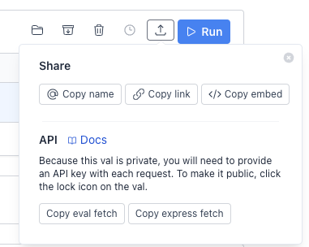

We shipped so many fun, little improvements over the past two weeks! There’s something in the release for everyone: val.new, run vals unauthenticated, better login (with Github!), val usage analytics, share URL images, better search & autocomplete, 2x faster fetch, vim keybindings, and a way to run scheduled vals immediately!

### Changelog

### [val.new](https://val.new)

[https://twitter.com/stevekrouse/status/1640411661335969799?s=20](https://twitter.com/stevekrouse/status/1640411661335969799?s=20)

### Run vals without an account

[https://twitter.com/stevekrouse/status/1640461961346564096?s=20](https://twitter.com/stevekrouse/status/1640461961346564096?s=20)

### `// Forked from` convention

[https://twitter.com/stevekrouse/status/1640802636424269854?s=20](https://twitter.com/stevekrouse/status/1640802636424269854?s=20)

### Github Login (Clerk Auth)

[https://twitter.com/stevekrouse/status/1641912167795503107](https://twitter.com/stevekrouse/status/1641912167795503107)

### Val Usages Stats

[https://twitter.com/stevekrouse/status/1641881573925572636?s=20](https://twitter.com/stevekrouse/status/1641881573925572636?s=20)

### Val Share URL Image

Now when you paste a val URL into Twitter or Discord or anywhere

Tom did some real magic to make these work! You can access them for public vals by adding .png at the end of the URL: [https://www.val.town/healeycodes.bookmarks.png](https://www.val.town/healeycodes.bookmarks.png)

### Better search & autocomplete

[https://twitter.com/stevekrouse/status/1644405517911982080?s=20](https://twitter.com/stevekrouse/status/1644405517911982080?s=20)

### 2x faster `fetch`

When you make a `fetch` (HTTP request) from Val Town, we proxy it through a proxy service, because we don’t want all our user’s requests coming from the same IP address. This would be a nightmare for rate-limiting!

We’ve been using residential proxies, because they’re somewhat more versatile, but also way more expensive, slower, and inconsistent. So I experimented with datacenter proxies, and they worked in all the cases I tested, and so we made the switch. Val Town is ~2x faster on `fetch` calls on average, and we no longer have the occasional stray fetch that takes super long — or at least not nearly as often.

### Vim keybindings

[https://twitter.com/stevekrouse/status/1644408567242399771?s=20](https://twitter.com/stevekrouse/status/1644408567242399771?s=20)

### `Run now` button for scheduled vals

[https://twitter.com/stevekrouse/status/1644415310936645636?s=20](https://twitter.com/stevekrouse/status/1644415310936645636?s=20)

### Compressed val share action buttons

In the last newsletter, we discussed how we [keep tweaking the val header](https://blog.val.town/blog/val-town-newsletter-5#29cca168a9f343c59fc948f9d4f37887). The main effort this month was compressing it a bit, putting all the “share”-related buttons into a single menu, including the API links, and removing the three dots menu that used to be at the end of vals.

### Roadmap

Rodrigo is focused on making Val Town easier to learn and onboard to. Tom is building quick-win features. I (Steve) am tweeting all day every day, trying to spark creativity and get vals to go viral. Andre is getting married!

### Cool Vals

I’m going light on the cool vals this month. I don’t want to crash your browser with all the embeds! Head on over to [val.town/explore](http://val.town/explore) to see what folks are up to!

[https://twitter.com/stevekrouse/status/1644362429323681792?s=20](https://twitter.com/stevekrouse/status/1644362429323681792?s=20)

[https://twitter.com/stevekrouse/status/1641469999687581696?s=20](https://twitter.com/stevekrouse/status/1641469999687581696?s=20)

[https://twitter.com/stevekrouse/status/1644037215385710629?s=20](https://twitter.com/stevekrouse/status/1644037215385710629?s=20)

  <iframe src="https://www.val.town/embed/@stevekrouse.easyAQIExample" width="100%" frameborder="no" style="height: 400px;">
    &#x20;
  </iframe>

  <iframe src="https://www.val.town/embed/@healeycodes.todos" width="100%" frameborder="no" style="height: 400px;">
    &#x20;
  </iframe>

  <iframe src="https://www.val.town/embed/@maxdrake.chatGPT" width="100%" frameborder="no" style="height: 400px;">
    &#x20;
  </iframe>

