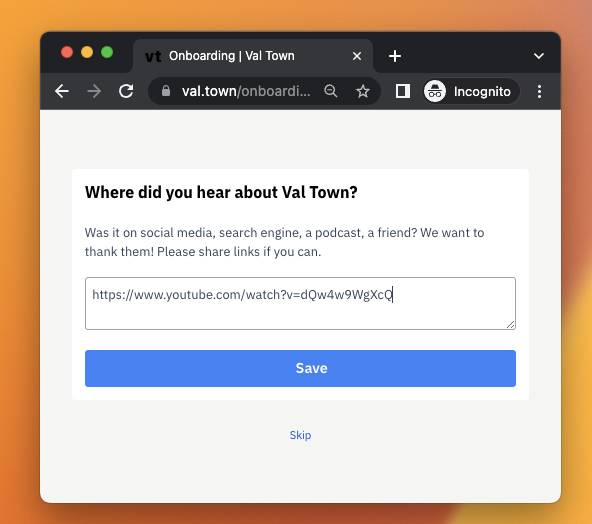

The last month saw us do two huge infrastructure projects: moving off of
Supabase and moving to Restricted Library Mode semantics. We also shipped dozens
of smaller improvements, including the ability to ❤️ a val, inline npm search, an
onboarding tutorial, val references, redesigned tracing, API tokens, and more!

The roadmap over the coming months is incredibly exciting! I don’t know exactly
in what order we’ll get to everything, but we’re planning simpler privacy
controls, oauth helpers, error reporting, pricing, subdomains, typescript
imports, comments, readmes, a vscode plugin, GPT somewhere, a legit logo, swag,
and much more!

I didn’t have time to compile a “cool vals” section for this newsletter, but you
can help me do it for next time by liking vals that you find interesting or
useful. The explore page does rank vals with more likes higher, and we’ll
continue to iterate on its formula over the coming weeks.

### Changelog

### Migrated off Supabase

We found ourselves being slowed down by Supabase, so we took a couple weeks to
move off it, with zero downtime! We’re now on trpc, zod, drizzle, and can run
test and local copy of our database, including in preview branches and github
actions tests. We’ve gotten a lot of questions about this, so you can expect a
blog post about it this week.

### Restricted Library Mode & v1 API

We shifted our semantics to be safer and more explicit, and launched our API v1
around the new semantics. This was a big effort and a breaking change, so we
really appreciate how everyone stepped up to make this as seamless as possible.
If you’ve been using Val Town for a while, you should probably read about the
change:
[Restricted Library Mode](https://blog.val.town/blog/restricted-library-mode).

### Val references (backlinks)

You can now click on the references for each val. You can see that
`@stevekrouse.fetchJSON` was referenced 619 times, and when you click on it you
can see the 208 vals that use it that are public.

<video controls><source src="/video/screenshot_2023-05-15_at_144032.mp4" /></video>

### Tracing (evaluations) redesign

Tom redesigned our tracing view. If you are logged in, you will be able to click
the number of times a val has been run, and then view all runs of that val that
happened in your Val Town account. (You won’t be able to see when other people
ran that val on their account. You _will_ be able to see it if they ran it via
your API. These semantics are discussed in the
[Restricted Library Mode](https://blog.val.town/blog/restricted-library-mode)
blog post.)

<video controls><source src="/video/screenshot_2023-05-15_at_144142-converted.mp4" /></video>

### NPM Search inline

<video controls><source src="/video/screenshot_2023-05-12_at_135727.mp4" /></video>

### Likes

[https://twitter.com/stevekrouse/status/1655964314941943810?s=20](https://twitter.com/stevekrouse/status/1655964314941943810?s=20)

### Homepage Showcase

Now we talk about some of our best features on the homepage: cron jobs,
`console.email`, APIs and imports!

<video controls><source src="/video/screenshot_2023-05-15_at_160852-converted.mp4" /></video>

### Onboarding Tutorial

### Profile stats

### Val Town API Tokens

We made a proper page to get your Val Town API tokens. We now also support
multiple tokens, and the ability to delete tokens:
[/settings/api](https://www.val.town/settings/api).

### All Val Versions

Sometimes it’s useful to see every version of every val you’ve ever created,
including deleted vals, so you can restore them.

<video controls><source src="/video/screenshot_2023-05-15_at_144816.mp4" /></video>

### First YouTube / TikTok / podcast / livestream

I made a YouTube video and TikToks about how to send form data to Val Town. I
was also on the devtools FM podcast and endingwithali’s livestream. Please reach
out if you have a podcast or livestream and you’d like to chat about Val Town,
devtools, the future of coding, etc ❤️

  <lite-youtube videoid="YfhPKlg5flM">
    &#x20;
  </lite-youtube>

  <lite-youtube videoid="AGDFDy7rYIo">
    &#x20;
  </lite-youtube>

[https://www.tiktok.com/@stevekrouse/video/7221293743985462533?lang=en](https://www.tiktok.com/@stevekrouse/video/7221293743985462533?lang=en)

### Gallery

[We threw together a little gallery](https://gallery.val.town/), so you could
see how folks connect Val Town to their favorite apps, like OpenAI GPT, Discord,
Slack, Google Sheets, Github, Telegram, Mastodon, Resy, Twitter, etc.

### Page navigation loading progress bar

When you click on a link that takes a couple seconds to load, you’ll see the
classic progress bar loader at the top of the screen.

<video controls><source src="/video/my_movie.mp4" /></video>

### Userspace Cron

While it may take us another couple of weeks to build cron into the product, I
did throw together a version that works in userspace!

  <iframe src="https://www.val.town/embed/@stevekrouse.cron" width="100%" frameborder="no" style="height: 400px;">
    &#x20;
  </iframe>

### Where did you hear about us?

I know it’s annoying but we need to know where folks are hearing about us.

### Clickable URLs in the val editor

Press cmd, then click.

<video controls><source src="/video/screenshot_2023-05-15_at_150608.mp4" /></video>

### Customizable profile pic

<video controls><source src="/video/screenshot_2023-05-15_at_150749.mp4" /></video>

### Misc

- the empty new val editor component is on almost every page (the homepage,
  user’s profiles, viewing a single val) even when logged out
- much fewer auth bugs
- userspace [cron](https://www.val.town/v/stevekrouse.cron) (proper cron in the
  product should be coming soon)
- swr → react-query
- stop crashing on Safari 15
- Upgrade to deno 1.33.0

### Roadmap

We so many fun ideas + projects coming up! I don’t know exactly the order these
all will happen in, so reach out if you have strong preferences on what happens
sooner rather than later.

- Simpler Privacy Controls
- More web-standard and JS compatibility
- The ability to rename a val
- Val version pinning
- Multiline vals (modules)
- Val Town “Store” & ReadMe - show off how to use your vals
- Pricing - $8 / month for pro features
- OAuth Helpers - get auth tokens to your favorite apps
- (Custom) Error Reporting - get notifications when your vals error
- Subdomain API - needed to make ChatGPT plugins
- Typescript types for imports from npm
- Comments on vals
- VSCode Plugin (edit vals from VSCode)
- Integrated GPT - have AI write your vals for you
- Logo + initial swag
