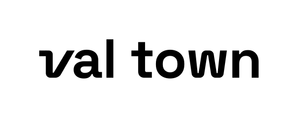
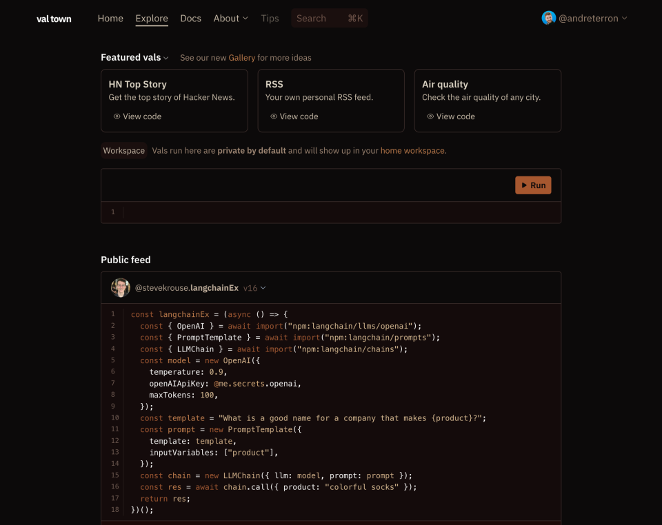

We shipped A LOT in the last two weeks, including Val Town Pro, a new logo, the
ability to rename Vals, code search, hnFollow, a blog about Migrating off
Supabase, simpler privacy controls, more consistent evaluation performance, and
much more!

We love seeing all the cool Vals y’all are making, and included some of our
favorites below. Please message us or post in the Discord if you’re doing
something cool — it’s hard to stay on top of it all! Our dream is for a Val to
be a self-contained, web primitive, that can go viral like how a Github Repo can
be on the front page of HN, subreddits, and Twitter. We’re also hoping to make
our [feed of Vals](https://val.town/explore) more consistently interesting, and
hope to have some movement in that direction by the next update!

The roadmap over the coming months is very exciting. We don’t know exactly in
what order we’ll get to everything, but we’re planning OAuth helpers, error
reporting, subdomain API, autosave, public folders, val version pinning,
typescript imports, comments, READMEs, a vscode plugin, embedded LLMs somewhere,
swag, and much more! We’re very eager for feedback, so please reach out if you
have opinions on what we should tackle sooner rather than later.

### Changelog

### Val Town Pro (beta)

Val Town will always be free, with generous limits. Now there is a way to pay
for more.

Introducing [Val Town Pro](https://val.town/pricing): run longer and more
frequent vals, make more fetches, retain logs longer, store more data, and make
unlimited private vals.

### New Logo

We worked with the fantastic [Will Dove](https://www.willdove.com/) to craft a
basic logo we’re excited about.

#### Logotype

#### Logo

#### Logo right-click

You can access these assets at by right-clicking the logo (hat tip to Linear and
Vercel) or by going directly to [val.town/brand](https://val.town/brand).

### Search Val code

In addition to val name search, you can now search folder names and the
full-text of the code of the current version of Vals. Search is so important and
leaves room for endless improvement. Code-search is particularly hard because
engines that work well on natural language don't work well on code. We've barely
begun to work on this problem. This version of search merely does an `ilike`
query in postgres. However even just this basic version is incredibly powerful.
Before you make something new in VT, take a moment to search to see if someone
else has already done it.

<video controls><source src="/video/ujsudgkl2mbfjbak.mp4" /></video>

### Rename Vals

At long last you can rename Vals! This is the oldest and biggest complaint users
have about Val Town. You used to have to create a new val with the new name and
then go back and delete the old val with the old name. Now vals are canonically
represented by their ID in the database, and changing their names is a single
operation. Over time we will make this refactor even more seamless, guiding you
through replacing the name change across all references, and/or creating a
"symlink".

<video controls><source src="/video/jmycrh46j7z2cli-.mp4" /></video>

### hnFollow

This “app” was built in an experimental style on Val Town that you can install
with one click and infinitely customize. We think we’re pointing towards a new
web primitive that you can:

1. write like a function
2. run like a script
3. fork like a repo
4. install like an app

This is our 5th iteration of this same “HN Follow” app. We launched the
[3rd version on Hacker News six months ago](https://news.ycombinator.com/item?id=33533830).
This version was [well received](https://news.ycombinator.com/item?id=36071183)
(133 upvotes and 30 installs).

### Migrating off Supabase Blog

We recently moved off of Supabase, and got a lot of questions about it. We
worked hard to write
[a fair and honest post](https://blog.val.town/blog/migrating-from-supabase),
and were really pleased by how it turned out, how it was recieved by the folks
at Supabase, and [on HN](https://news.ycombinator.com/item?id=36004925).

  <iframe src="https://blog.val.town/blog/migrating-from-supabase" width="100%" frameborder="no" style="height: 400px;">
    &#x20;
  </iframe>

### Simpler privacy controls

Val Privacy used to be tied to specific versions of vals. Now privacy is a
property of _*all*_ versions of a val, and you can easily toggle it back and
forth.

<video controls><source src="/video/screenshot_2023-05-31_at_171216.mp4" /></video>

### More consistent performance

Due to a memory leak somewhere deep in deno+v8, Val execution time would slowly
creep up to up to 4 seconds, even for simple Vals! We invested a lot of time in
our monitoring infrastructure around execution time, and also got a workaround
in place that brings execution time back down in the more reasonable 300-500ms
range. You can
[time us yourself](https://www.val.town/v/stevekrouse.measureValTownE2e) from
inside Val Town!

### Workspaces Refactor

The initial version of workspaces & folders was hacked together over the
Christmas holiday into a JSON column in our database. We rewrote it so that each
folder is represented as a proper row in the database, so everything will be
faster and there will be way fewer bugs. We also took the opportunity to
simplify how folders show up in the interface. Now they appear at the top in
alphabetical order, instead of inline with Vals. We’ll continue to invest in Val
organization, and this refactor laid the groundwork for that work.

### Langchain support

Now you can use langchain in Val Town! Thanks to Wade Warren for reporting
[the issue](https://github.com/hwchase17/langchainjs/issues/1412) and Jacob Lee
for the [super quick fix](https://github.com/hwchase17/langchainjs/pull/1413).

  <iframe src="https://www.val.town/embed/stevekrouse.langchainEx" width="100%" frameborder="no" style="height: 400px;">
    &#x20;
  </iframe>

### Misc

- [tutorial](https://val.town/docs/tutorial) broken up into separate pages
- prettier → dprint (faster, less memory footprint)
- archive & delete buttons → organize menu (simpler val header)
- auto-fix static imports (because we only allow dynamic imports currently)
- `replyTo` in `console.email`
  ([usecase](https://twitter.com/stevekrouse/status/1661000258116100096))
- massively deprioritize untitled vals from autocomplete
- hide “inspiration” in the new Val editor in folders (Mary Rose Cook asked for
  a “tidy ship”)
- scheduled vals run immediately when scheduled (not sure if we’ll keep this
  behavior)
- make usernames citext (to prevent collisions due to uppercase/lowercase)
- catch more errors with a cleaner error page
- upgrade to deno 1.33.3
- database cleanups & performance improvements, no more materialized views, so
  everything should be consistent instantly (no waiting a minute for changes to
  propagate)

### Roadmap

We try to balance quality-of-life improvements with shiny new superpowers. As
always, we really appreciate your input on what we should work on, and how we
should prioritize it. Here’s generally what we’re excited to work on in the
coming weeks:

- Cron-syntax Scheduled Vals (Almost made today’s newsletter! You may see it
  tonight!)
- Big refactors & simplifications of the ValEditor and Workspace components
- Autosave Val work-in-progress
- Typescript types for imports from npm
- Error Reporting - get notifications when your vals error
- More/better proxies for `fetch`
- Swag
- OAuth Helpers - get auth tokens to your favorite apps
- Public folders
- Subdomain API - needed to make ChatGPT plugins
- Val “app store” or “template collection”
- Val READMEs
- Comments on vals
- Val version pinning
- Integrated LLMs (have AI write your vals for you)
- More web-standard and JS compatibility
- VSCode Plugin (edit vals from VSCode)

### Cool Vals

  <iframe src="https://www.val.town/embed/liamdanielduffy.upscaleThisUrl" width="100%" frameborder="no" style="height: 400px;">
    &#x20;
  </iframe>

  <iframe src="https://www.val.town/embed/ramkarthik.raindropBookmarksToEmail" width="100%" frameborder="no" style="height: 400px;">
    &#x20;
  </iframe>

  <iframe src="https://www.val.town/embed/deeplyscenery.pokenames" width="100%" frameborder="no" style="height: 400px;">
    &#x20;
  </iframe>

  <iframe src="https://www.val.town/embed/octref.updateISBNFile" width="100%" frameborder="no" style="height: 400px;">
    &#x20;
  </iframe>

  <iframe src="https://www.val.town/embed/octref.handleForm" width="100%" frameborder="no" style="height: 400px;">
    &#x20;
  </iframe>

  <iframe src="https://www.val.town/embed/siygle.sendPostToBsky" width="100%" frameborder="no" style="height: 400px;">
    &#x20;
  </iframe>

  <iframe src="https://www.val.town/embed/mjd.hnClojure" width="100%" frameborder="no" style="height: 400px;">
    &#x20;
  </iframe>

  <iframe src="https://www.val.town/embed/sam.dailyTerraformProviderDownloads" width="100%" frameborder="no" style="height: 400px;">
    &#x20;
  </iframe>

  <iframe src="https://www.val.town/embed/jaandrle.mastodon$instances_cz_stats_last_week" width="100%" frameborder="no" style="height: 400px;">
    &#x20;
  </iframe>

  <iframe src="https://www.val.town/embed/stevekrouse.myIps" width="100%" frameborder="no" style="height: 400px;">
    &#x20;
  </iframe>

  <iframe src="https://www.val.town/embed/pettan.generateRAdioDjRss" width="100%" frameborder="no" style="height: 400px;">
    &#x20;
  </iframe>

  <iframe src="https://www.val.town/embed/ofalvai.fetchReadwiseList" width="100%" frameborder="no" style="height: 400px;">
    &#x20;
  </iframe>

  <iframe src="https://www.val.town/embed/yieldray.reqFresh" width="100%" frameborder="no" style="height: 400px;">
    &#x20;
  </iframe>

  <iframe src="https://www.val.town/embed/rlesser.pushover" width="100%" frameborder="no" style="height: 400px;">
    &#x20;
  </iframe>

  <iframe src="https://www.val.town/embed/politelyinvinciblepointer.handleForm" width="100%" frameborder="no" style="height: 400px;">
    &#x20;
  </iframe>

  <iframe src="https://www.val.town/embed/fab1an.getRandomArticleInCategory" width="100%" frameborder="no" style="height: 400px;">
    &#x20;
  </iframe>

  <iframe src="https://www.val.town/embed/fgeierst.pushToArchive" width="100%" frameborder="no" style="height: 400px;">
    &#x20;
  </iframe>

  <iframe src="https://www.val.town/embed/sam.storeTerraformProviderDownloadCount" width="100%" frameborder="no" style="height: 400px;">
    &#x20;
  </iframe>

  <iframe src="https://www.val.town/embed/panphora.btcPrice" width="100%" frameborder="no" style="height: 400px;">
    &#x20;
  </iframe>

Not technically Val, [@rlesser](https://www.val.town/rlesser)’s
[Val Town Dark Mode Arc Boost](https://arc.net/boost/0C2FA225-3CA6-4273-B755-217691B5F9B5)
is one of our favorite community projects!
