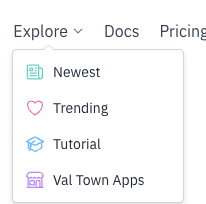

In the last two weeks, we shipped a huge refactor of our main val editor
component and many other improvements, including cron-style scheduled vals, npm
type imports, a split between newest and trending vals, new guides and
reorganized docs, bios on profile pages, a feedback button, a redesign of our
onboarding tutorial, an onboarding survey, a prettier val share image, and more!

Our pricing page was on the front page of Hacker News last week! We are now
making tens of dollars in revenue. Per month! We were also featured on a couple
of JavaScript newsletters recently, so hello new friends 👋

🎓 If you’re new, we recommend our
[tutorial](https://www.val.town/docs/tutorial), asking questions in the
[Discord](https://discord.gg/dHv45uN5RY), and checking out some of the new
guides in our [docs](https://docs.val.town)
([Github](https://docs.val.town/receiving-a-github-webhook),
[Discord](https://docs.val.town/discord),
[webhooks](https://docs.val.town/creating-a-webhook),
[render HTML](https://docs.val.town/rendering-html),
[persist data](https://docs.val.town/persistence-databases/persisting-100kb)).

### Changelog

### Val Editor Refactor

Tom led a huge effort to refactor our Val Editor components, to make them
simpler, less buggy, more versatile, and most importantly, SSR so google will
finally respect us.

<video controls>
<source src="/video/comparison.mp4" />
</video>

### Cron-style scheduled vals

Use crontab syntax to schedule vals to run exactly when you want. This has been
one of our most requested features since we launched in January.

### NPM Type Acquisition

Explore the names & types of library functions without leaving Val Town!

<video controls><source src="/video/screenshot_2023-06-16_at_171613.mp4" /></video>

This is very beta software. We recommend only turning it on when you need it and
then turning it off right after. There is still a lot of work we need to do to
ensure we don’t try to pull too many TS files and crash your browser. You can
turn it on at
[https://www.val.town/settings/preferences](https://www.val.town/settings/preferences).

### Tutorial redesign

In the [onboarding tutorial](https://val.town/docs/tutorial), we moved the
_Publish an API_ step from the end to the beginning, because it was everyone’s
favorite step. We also made the steps clearer, and added a table of contents.

### Onboarding survey

We now collect this wonderful data about what you’re looking to do with Val
Town, what APIs you want to use, and how you heard about us. We apologize if
it’s a bit annoying to fill out, but it’s gold to us.

Here’s what the responses look like:

### Explore Menu

Our Explore menu now gives you a number of options:

1. [Newest](https://www.val.town/newest) - public vals, sorted by time
2. [Trending](https://www.val.town/trending) - public vals sorted by likes with
   a time decay
3. [Tutorial](https://www.val.town/docs/tutorial) - the onboarding tutorial
4. [Val Town Apps](https://www.val.town/appstore) - right now it just links to
   the one [hnFollow](https://www.val.town/v/rodrigotello.hnFollow) app.

The biggest win here is that we’ve divorced newest from trending, so you should
be likelier to see cool stuff whenever you click on trending. Vals require at
least one like to show up there. Over time we may increase that limit.

### Docs Reorganization

I finally gave the docs some much needed love and a cleaner reorganization
popped out. We still need to do a better job making a distinction between
tutorials, guides, and community-examples, but it’s a start!

### Profile Page Bio

We now support 256 character bios on profile pages. You can set yours at
[https://www.val.town/settings/preferences](https://www.val.town/settings/preferences).

### Feedback button

All the cool kids are using it. You should too!

### Quick Guide

When you’re a new user, we now have a nifty quick guide to present to you:

### Fully automated Pricing Page

Now we rely on Stripe webhooks to know when to upgrade your account — instead of
manually setting it ourselves in the database. You get this sexy new
_Pro_ badge when you upgrade.

### Better “New Folder” button

### Cleaner share image

When you embed a val link somewhere like a tweet, we generate a sexy share image
for you that includes your profile photo, our new logo, and the code.

### Misc

- Toggle [active](https://www.val.town/settings/intervals) vs
  [cleared](https://www.val.town/settings/intervals?cleared=true) intervals
- `crypto.subtle` is now included in our runtime
- Reorganized & cleaner main menu & settings page

### Roadmap

- READMEs on vals
- Val version pinning & http import
- More/better proxies for `fetch`
- Swag
- More guides
- Autosave Val work-in-progress
- Error Reporting - get notifications when your vals error
- OAuth Helpers - get auth tokens to your favorite apps
- Public folders
- Subdomain API - needed to make ChatGPT plugins
- Val “app store” or “template collection”
- Comments on vals
- Integrated LLMs (have AI write your vals for you)
- More web-standard and JS compatibility
- VSCode Plugin (edit vals from VSCode)

### Cool vals

  <iframe src="https://www.val.town/embed/nbbaier.sunbeamExtension" width="100%" frameborder="no" style="height: 400px;">
    &#x20;
  </iframe>

  <iframe src="https://www.val.town/embed/vtdocs.reactSSRExample" width="100%" frameborder="no" style="height: 400px;">
    &#x20;
  </iframe>

  <iframe src="https://www.val.town/embed/stevekrouse.whatIsValTown" width="100%" frameborder="no" style="height: 400px;">
    &#x20;
  </iframe>

  <iframe src="https://www.val.town/embed/pomdtr.SearchValTown" width="100%" frameborder="no" style="height: 400px;">
    &#x20;
  </iframe>

  <iframe src="https://www.val.town/embed/jacoblee93.conversationalRetrievalQAChainSummaryMemory" width="100%" frameborder="no" style="height: 400px;">
    &#x20;
  </iframe>

  <iframe src="https://www.val.town/embed/vtdocs.markdownExample" width="100%" frameborder="no" style="height: 400px;">
    &#x20;
  </iframe>

  <iframe src="https://www.val.town/embed/ktm.isMyWebsiteDown" width="100%" frameborder="no" style="height: 400px;">
    &#x20;
  </iframe>

  <iframe src="https://www.val.town/embed/mangadex.login" width="100%" frameborder="no" style="height: 400px;">
    &#x20;
  </iframe>

  <iframe src="https://www.val.town/embed/ttul.rimworld_modpicker" width="100%" frameborder="no" style="height: 400px;">
    &#x20;
  </iframe>

  <iframe src="https://www.val.town/embed/aeaton.fetchHtmlDom" width="100%" frameborder="no" style="height: 400px;">
    &#x20;
  </iframe>

  <iframe src="https://www.val.town/embed/aeaton.peelSessionLetters" width="100%" frameborder="no" style="height: 400px;">
    &#x20;
  </iframe>

  <iframe src="https://www.val.town/embed/easrng.preactWebApp" width="100%" frameborder="no" style="height: 400px;">
    &#x20;
  </iframe>

  <iframe src="https://www.val.town/embed/yieldray.kv" width="100%" frameborder="no" style="height: 400px;">
    &#x20;
  </iframe>

  <iframe src="https://www.val.town/embed/yieldray.anime" width="100%" frameborder="no" style="height: 400px;">
    &#x20;
  </iframe>

  <iframe src="https://www.val.town/embed/stevekrouse.btcPriceAlert" width="100%" frameborder="no" style="height: 400px;">
    &#x20;
  </iframe>

  <iframe src="https://www.val.town/embed/stevekrouse.githubFollowing" width="100%" frameborder="no" style="height: 400px;">
    &#x20;
  </iframe>

  <iframe src="https://www.val.town/embed/zzz.RateLimitDemo" width="100%" frameborder="no" style="height: 400px;">
    &#x20;
  </iframe>

  <iframe src="https://www.val.town/embed/zzz.TokenizerDemo" width="100%" frameborder="no" style="height: 400px;">
    &#x20;
  </iframe>

  <iframe src="https://www.val.town/embed/zzz.Tokenizer" width="100%" frameborder="no" style="height: 400px;">
    &#x20;
  </iframe>

  <iframe src="https://www.val.town/embed/zzz.YoutubeSummary" width="100%" frameborder="no" style="height: 400px;">
    &#x20;
  </iframe>

  <iframe src="https://www.val.town/embed/ramkarthik.generateQR" width="100%" frameborder="no" style="height: 400px;">
    &#x20;
  </iframe>

  <iframe src="https://www.val.town/embed/stevekrouse.notionDateMeDocNotify3" width="100%" frameborder="no" style="height: 400px;">
    &#x20;
  </iframe>

  <iframe src="https://www.val.town/embed/stevekrouse.notionGetDatabaseEditedAfter" width="100%" frameborder="no" style="height: 400px;">
    &#x20;
  </iframe>

  <iframe src="https://www.val.town/embed/ramkarthik.generateQR" width="100%" frameborder="no" style="height: 400px;">
    &#x20;
  </iframe>

  <iframe src="https://www.val.town/embed/generatecoll.generative_ascii_pattern" width="100%" frameborder="no" style="height: 400px;">
    &#x20;
  </iframe>

  <iframe src="https://www.val.town/embed/stevekrouse.bskySocialEx" width="100%" frameborder="no" style="height: 400px;">
    &#x20;
  </iframe>

  <iframe src="https://www.val.town/embed/mangadex.listFeed" width="100%" frameborder="no" style="height: 400px;">
    &#x20;
  </iframe>

  <iframe src="https://www.val.town/embed/piotr.searchManifoldMarkets" width="100%" frameborder="no" style="height: 400px;">
    &#x20;
  </iframe>

  <iframe src="https://www.val.town/embed/vlad.sendMatrixChatRoomMessage" width="100%" frameborder="no" style="height: 400px;">
    &#x20;
  </iframe>

  <iframe src="https://www.val.town/embed/MattieTK.laMetricOctopus" width="100%" frameborder="no" style="height: 400px;">
    &#x20;
  </iframe>

  <iframe src="https://www.val.town/embed/zzz.OpenAISummary" width="100%" frameborder="no" style="height: 400px;">
    &#x20;
  </iframe>

  <iframe src="https://www.val.town/embed/vtdocs.verifyGithubWebhookSignature" width="100%" frameborder="no" style="height: 400px;">
    &#x20;
  </iframe>

  <iframe src="https://www.val.town/embed/MattieTK.octopusAgilePricingLondon" width="100%" frameborder="no" style="height: 400px;">
    &#x20;
  </iframe>

  <iframe src="https://www.val.town/embed/sourishkrout.runmeTotals" width="100%" frameborder="no" style="height: 400px;">
    &#x20;
  </iframe>

